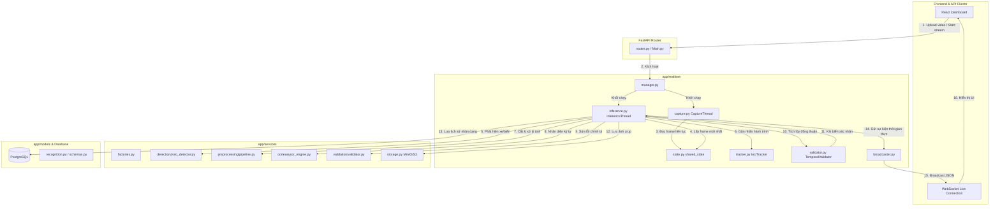

# 🚗 Hệ Thống Nhận Diện Biển Số Xe Thời Gian Thực (Real-Time LPR System)

Hệ thống nhận diện biển số xe (License Plate Recognition - LPR) thời gian thực được thiết kế theo mô hình **Monorepo** sử dụng kiến trúc phân lớp tách biệt (Decoupled Architecture). Hệ thống tích hợp các mô hình Deep Learning (YOLOv8, EasyOCR) được tối ưu hóa cao hiệu năng chạy trực tiếp trên CPU, kết nối trực tiếp với giao diện qua giao thức WebSockets để hiển thị luồng live stream và cập nhật thông tin xe tức thời.

Dự án hỗ trợ nhận diện cả hai định dạng biển số của **Brazil** (bao gồm biển Mercosul mới `AAA0A00` / `AAA0000` và biển định dạng cũ) cũng như định dạng biển số của **Vương quốc Anh (GB)**.

---

## 📸 Hình Ảnh Giao Diện (Screenshots Showcase)

Dưới đây là một số hình ảnh thực tế từ giao diện quản trị và luồng giám sát thời gian thực của dự án:

### 1. Giao Diện Giám Sát Camera Trực Tuyến (Live Monitoring Dashboard)
Trang giám sát hiển thị luồng video thời gian thực từ camera/tệp tin, vẽ bounding boxes động cho phương tiện và biển số xe (được mã hóa màu theo trạng thái), đồng thời hiển thị danh sách các phương tiện đang theo dấu (Active Tracks) và lịch sử biển số được xác nhận thành công gần đây.


### 2. Danh Sách Lịch Sử Nhận Diện (Recognition History)
Bảng lịch sử quản lý chi tiết toàn bộ các lượt xe đi qua camera. Hỗ trợ tìm kiếm, phân trang và hiển thị nhanh hình ảnh xe đã cắt (crop), biển số nhận diện được cùng chỉ số độ tin cậy trung bình.


### 3. Giao Diện Xem Chi Tiết & Duyệt Thủ Công (Detection Details & Reprocess)
Trang chi tiết cung cấp ảnh toàn cảnh, ảnh crop biển số độ phân giải cao và biểu đồ phân tích độ tin cậy chi tiết cho 3 yếu tố: Phát hiện (Detection), Ký tự (OCR) và Tổng hợp. Với các biển số có độ tin cậy thấp, hệ thống sẽ cảnh báo trạng thái `NEEDS_REVIEW` để người dùng có thể chỉnh sửa thủ công và yêu cầu chạy reprocess.


### 4. Tài Liệu Hướng Dẫn API FastAPI (Swagger UI API Docs)
FastAPI cung cấp giao diện Swagger UI trực quan giúp kiểm thử và tra cứu nhanh tất cả các API endpoints của hệ thống.


---

## 🛠️ Công Nghệ Sử Dụng (Tech Stack)

### **Frontend**
* **Framework:** React 19, Vite 6, TypeScript
* **Styling & UI:** Tailwind CSS, CSS Variables ([default_shadcn_theme.css](file:///d:/MySC/Python/BTL_AIT2004-2/frontend/default_shadcn_theme.css)) mang lại trải nghiệm dark/light mode mượt mà, hiện đại.
* **Giao tiếp:** WebSockets (kết nối trực tiếp nhận stream ảnh Base64 & metadata), REST API (Axios).

### **Backend & Machine Learning**
* **Core API:** Python 3.11, FastAPI (Uvicorn)
* **Object Detection:** YOLOv8 (định dạng `.onnx` tối ưu chạy qua ONNX Runtime).
* **OCR Engine:** EasyOCR (sử dụng PyTorch, tối ưu hóa suy diễn).
* **Database & Migration:** PostgreSQL 16 (SQLAlchemy ORM, Alembic migrations).
* **Storage:** MinIO Object Storage (tương thích AWS S3 để lưu trữ tệp hình ảnh xe & biển số).
* **Task Queue (Background):** Celery + Redis (broker) xử lý các luồng chạy ngầm bất đồng bộ.

### **DevOps & Infrastructure**
* **Containerization:** Docker & Docker Compose
* **Orchestration:** Quản lý đồng thời 4 services độc lập (`db`, `minio`, `api`, `frontend`).

---

## 📐 Kiến Trúc Hệ Thống (Project Architecture)

Hệ thống được tổ chức thành 3 lớp riêng biệt giúp tối ưu hóa khả năng mở rộng và bảo trì:



---

## ⚡ Các Tính Năng Nâng Cao & Tối Ưu Hóa (Advanced Optimizations)

Để giải quyết triệt để vấn đề sụt giảm khung hình (FPS 1-2) và tăng độ chính xác OCR khi chạy toàn bộ hệ thống trên môi trường **chỉ sử dụng CPU**, các giải pháp kỹ thuật nâng cao sau đã được triển khai:

1. **Kiến trúc Suy Diễn 3 Tầng & Cơ Chế Bỏ Qua Mô Hình Xe (Bypass Detection):**
   * Hệ thống ưu tiên chạy bộ phát hiện biển số YOLOv8 tùy chỉnh (`yolov8-plate-v1.onnx`) ở **Tier 1**.
   * **Bypass Optimization:** Khi Tier 1 tìm thấy biển số xe thành công, hệ thống sẽ tự động vẽ một hộp bao giả lập cho phương tiện bao quanh biển số đó và **bỏ qua hoàn toàn forward pass của mô hình phát hiện xe COCO (`yolov8n.onnx`)** ở Tier 2. Điều này tiết kiệm được 1/2 tài nguyên GPU/CPU suy diễn.
   * Nếu Tier 1 thất bại, hệ thống mới kích hoạt Tier 2 (phát hiện xe và tự động suy diễn tọa độ biển số dựa trên hình học 70% phía dưới xe). Nếu cả hai thất bại, hệ thống fallback về Tier 3 (sử dụng toàn bộ ảnh làm vùng chứa biển).

2. **Cắt Nửa Dưới Khung Hình (Bottom-Half ROI Crop):**
   * Video camera tĩnh thường chứa nhiều không gian thừa (bầu trời, cây cối, xe ở rất xa) ở nửa trên.
   * Luồng inference tự động crop lấy nửa dưới của ảnh (`bottom_half = frame[h // 2 :, :]`) trước khi nạp vào mô hình YOLO.
   * Giải pháp này loại bỏ nhiễu ngoại cảnh, làm nổi bật biển số xe khi đến gần và tăng tốc độ xử lý do giảm dung lượng vùng đệm letterbox thực tế của mô hình. Tọa độ được tự động bù lại chính xác khi xuất ra giao diện.

3. **Bỏ Qua Khung Hình Phát Hiện (Detection Decimation):**
   * Bằng cách cấu hình `DETECTION_DECIMATION` (mặc định là `2` hoặc `3`), hệ thống chỉ chạy mô hình phát hiện YOLO/ONNX 1 lần mỗi $N$ khung hình.
   * Trên các khung hình bị bỏ qua, hệ thống sử dụng thuật toán theo vết `IoUTracker` để nội suy giữ nguyên tọa độ của phương tiện mà không cần chạy lại mô hình phát hiện. Điều này giúp **tăng tốc FPS lên gấp 2 đến 3 lần** trên môi trường CPU.

4. **Tối Ưu Hóa CPU Cho Bộ Nhận Diện EasyOCR (CRAFT Bypass):**
   * Mặc định, EasyOCR sử dụng mô hình CRAFT rất nặng để phát hiện chữ trong ảnh rồi mới chạy mô hình nhận diện ký tự (CRNN).
   * Do ảnh vùng biển số đã được YOLO khoanh vùng rất hẹp, hệ thống chuyển từ gọi hàm `.readtext()` sang `.recognize()` trong [easyocr_engine.py](file:///d:/MySC/Python/BTL_AIT2004-2/apps/api/app/services/ocr/easyocr_engine.py). 
   * Giải pháp này loại bỏ hoàn toàn mô hình CRAFT, giảm thời gian chạy OCR từ **~187ms xuống còn ~51ms (nhanh hơn 3.6 lần)** và loại bỏ triệt để lỗi phân mảnh ký tự biển số.

5. **Đồng Thuận Theo Thời Gian & Cơ Chế Duyệt Sớm (Temporal Consensus & Auto-Accept):**
   * Để chống rung lắc chữ trên video, `TemporalValidator` tích lũy kết quả OCR của cùng 1 xe qua tối đa 8 khung hình và thực hiện biểu quyết đa số (majority voting). Biển số chỉ được xác nhận (`confirmed`) khi có tối thiểu 3 khung hình đồng thuận.
   * **Auto-Accept:** Nếu có một khung hình đạt độ tin cậy cực cao ($\ge 0.85$ qua cấu hình `auto_accept_threshold`) và khớp chuẩn định dạng Regex quốc gia, hệ thống sẽ xác nhận ngay lập tức mà không cần chờ tích lũy đủ 3 khung hình, giúp tối ưu hóa thời gian phản hồi.

6. **Tự Động Sửa Lỗi Ký Tự OCR (OCR Corrections):**
   * Các chữ cái và chữ số thường bị nhận diện nhầm lẫn (như `O` thành `0`, `I` thành `1`, `Z` thành `2`, `S` thành `5`, `B` thành `8`).
   * Dựa vào cấu trúc vị trí ký tự chuẩn của biển số Brazil (Mercosul/Old), hệ thống tự động sửa đổi các ký tự này về dạng chuẩn. Nếu sửa lỗi thành công, hệ thống gán nhãn hợp lệ nhưng giảm nhẹ điểm số tự tin xuống `0.8` để phản ánh việc đã xử lý qua thuật toán.

7. **Giới Hạn Luồng Tính Toán Tránh CPU Thrashing:**
   * Khi chạy các gói toán học tuyến tính (PyTorch, ONNX, OpenCV) trên CPU đa nhân trong Docker, hệ thống dễ bị nghẽn (Thrashing) do sinh quá nhiều luồng tính toán song song cạnh tranh tài nguyên.
   * DevOps đã cấu hình giới hạn luồng về giá trị tĩnh `1` (`OMP_NUM_THREADS: 1`, `MKL_NUM_THREADS: 1`, v.v.) trong [docker-compose.yml](file:///d:/MySC/Python/BTL_AIT2004-2/docker-compose.yml#L47), giúp hệ thống hoạt động ổn định và mượt mà hơn.

---

## 🚀 Hướng Dẫn Khởi Chạy Dự Án (Getting Started)

### 📋 Yêu cầu hệ thống (Prerequisites)
* **Docker** 24.0+ và **Docker Compose** v2.0+
* **Node.js** 18+ & **Python** 3.11+ (nếu muốn chạy phát triển cục bộ không qua Docker)

---

### 🐳 Cách 1: Chạy bằng Docker Compose (Khuyên dùng - Nhanh nhất)

Đây là cách đơn giản nhất để khởi chạy toàn bộ hệ thống (Frontend, Backend, Database, MinIO) chỉ bằng một câu lệnh:

#### Bước 1: Sao chép tệp cấu hình môi trường
```bash
cp .env.example .env
```
*(Tệp `.env` mặc định đã được cấu hình sẵn các cổng kết nối và tài khoản an toàn).*

#### Bước 2: Khởi chạy toàn bộ các dịch vụ
```bash
docker compose up -d --build
```
*(Quá trình build ban đầu có thể mất một vài phút để tải các thư viện AI như PyTorch và ONNX Runtime).*

#### Bước 3: Kiểm tra trạng thái hoạt động của các container
```bash
docker compose ps
```
Cả 4 container (`db`, `minio`, `api`, `frontend`) phải hiển thị trạng thái `healthy` hoặc `running`.

---

### 💻 Cách 2: Chạy cục bộ từng dịch vụ (Phục vụ Phát triển/Debug)

Nếu bạn muốn chỉnh sửa code và chạy trực tiếp trên máy vật lý để debug nhanh:

#### 1. Khởi động hạ tầng cơ sở dữ liệu và lưu trữ (Docker chạy ngầm)
Chạy PostgreSQL và MinIO bằng Docker để đỡ mất công cài đặt lên máy:
```bash
docker compose up -d db minio
```

#### 2. Cài đặt và chạy Backend API
Di chuyển vào thư mục backend, thiết lập biến môi trường và cài đặt thư viện:
```bash
cd apps/api
cp .env.example .env
```

Cài đặt các gói phụ thuộc (khuyên dùng môi trường ảo `venv`):
```bash
python -m venv venv
# Trên Windows
.\venv\Scripts\activate
# Trên macOS/Linux
source venv/bin/activate

pip install -r requirements.txt
```

Khởi chạy cơ sở dữ liệu (Alembic migration) và khởi động server API:
```bash
# Thực hiện đồng bộ bảng dữ liệu
alembic upgrade head

# Chạy server FastAPI
python app/main.py
```
*(Nếu bạn muốn chạy Celery worker phục vụ xử lý ảnh upload tĩnh bất đồng bộ, hãy mở thêm một terminal và chạy lệnh: `celery -A app.worker.celery_app worker --loglevel=info`)*

#### 3. Cài đặt và chạy Frontend
Mở một terminal mới, di chuyển vào thư mục frontend:
```bash
cd frontend
npm install
npm run dev
```

---

## 🌐 Địa Chỉ Truy Cập Các Dịch Vụ (Port Mappings)

Khi hệ thống đã khởi động thành công, bạn có thể truy cập các địa chỉ sau:

| Dịch vụ | Địa chỉ truy cập | Ghi chú |
| :--- | :--- | :--- |
| **Frontend UI** | [http://localhost:5173](http://localhost:5173) | Giao diện quản trị, xem Live và lịch sử nhận dạng. |
| **Backend API Docs** | [http://localhost:8000/docs](http://localhost:8000/docs) | Swagger UI tài liệu API REST của FastAPI. |
| **MinIO Console** | [http://localhost:9001](http://localhost:9001) | Giao diện quản trị MinIO Object Storage (User/Pass: `minioadmin` / `minioadmin`). |
| **PostgreSQL DB** | `localhost:5433` | Cổng kết nối cơ sở dữ liệu vật lý (cổng trong container là `5432`). |

---

## 📁 Cấu Trúc Thư Mục Dự Án (Repository Structure)

```text
.
├── apps/api/                 # Backend API & Celery Worker
│   ├── app/
│   │   ├── api/              # Định nghĩa các REST API endpoints
│   │   ├── models/           # SQLAlchemy database entities & Pydantic schemas
│   │   ├── realtime/         # Trục xử lý video stream & WebSockets (Stateful)
│   │   │   ├── capture.py    # Luồng độc lập đọc camera/tệp tin bằng OpenCV
│   │   │   ├── inference.py  # Luồng phân tích trung tâm (YOLO -> Crop -> OCR)
│   │   │   ├── tracker.py    # IoUTracker theo vết đối tượng qua các frame
│   │   │   ├── validator.py  # TemporalValidator tích lũy đồng thuận chữ biển số
│   │   │   └── broadcaster.py# WebSocket broadcaster gửi dữ liệu tới React Client
│   │   ├── services/         # Các dịch vụ xử lý học máy không trạng thái (Stateless)
│   │   │   ├── detection/    # Bộ phát hiện biển số/xe (YOLOv8 ONNX Engine)
│   │   │   ├── ocr/          # Bộ nhận diện ký tự (EasyOCR Engine)
│   │   │   ├── preprocessing/# OpenCV pipeline (Deblur, CLAHE Enhance, Perspective)
│   │   │   └── validation/   # Bộ kiểm tra định dạng regex & tự sửa lỗi chính tả
│   │   └── main.py           # Điểm khởi chạy ứng dụng FastAPI chính
│   ├── models/onnx/          # Thư mục lưu trữ bộ trọng số YOLOv8 ONNX
│   ├── Dockerfile
│   └── requirements.txt
├── frontend/                 # Frontend React Single Page Application (SPA)
│   ├── src/
│   │   ├── app/
│   │   │   ├── live/         # Trang giám sát live stream & WebSocket canvas
│   │   │   ├── App.tsx       # Tuyến đường Router, Upload panel, Detail panel
│   │   │   └── api.ts        # Các hàm gọi API HTTP tới Backend
│   ├── default_shadcn_theme.css # Cấu hình CSS Variables và giao diện Dark/Light mode
│   ├── package.json
│   └── Dockerfile
├── reports/                  # Thư mục chứa báo cáo kỹ thuật chi tiết của các nhánh
│   ├── aiengineer.md         # Báo cáo tối ưu hóa AI Pipeline & FPS
│   ├── backend.md            # Báo cáo thiết kế cấu trúc Backend API
│   ├── database.md           # Thiết kế cơ sở dữ liệu & lưu trữ MinIO
│   ├── devops.md             # Tài liệu Docker Compose, Healthcheck & CPU limits
│   └── frontend.md           # Thiết kế luồng giao diện & WebSockets client
├── docker-compose.yml        # Tệp cấu hình điều phối toàn bộ Docker services
├── .env.example              # Tệp cấu hình biến môi trường mẫu
└── README.md                 # Tài liệu hướng dẫn chính của dự án
```

---

## 📡 Chi Tiết Các Sự Kiện WebSockets Trực Tuyến

Khi Client React kết nối tới cổng WebSocket tại địa chỉ `ws://localhost:8000/ws/live`, hệ thống sẽ truyền phát các sự kiện sau dưới dạng JSON:

1. **`frame.processed` (Gửi liên tục theo FPS thực tế):**
   * Truyền ảnh frame video hiện thời (được nén và mã hóa dạng Base64) kèm danh sách phương tiện đang được theo dấu để Client vẽ lên Canvas.
   ```json
   {
     "type": "frame.processed",
     "timestamp": "2026-06-23T15:26:42+07:00",
     "image_base64": "/9j/4AAQSkZJRgABAQAAAQABAAD...",
     "fps": 24.5,
     "data": {
       "detections": [
         {
           "track_id": 3,
           "vehicle_bbox": {"x": 20, "y": 45, "width": 30, "height": 50},
           "plate_bbox": {"x": 32, "y": 78, "width": 10, "height": 5},
           "status": "pending",
           "text": "ABC1D23",
           "confidence": 92
         }
       ]
     }
   }
   ```

2. **`plate.confirmed` (Khi biển số xe đạt đủ đồng thuận / được Auto-Accept):**
   * Kích hoạt lưu trữ ảnh crop vào MinIO, ghi lịch sử vào database Postgres và thông báo sự kiện để hiển thị lên bảng kết quả.
   ```json
   {
     "type": "plate.confirmed",
     "timestamp": "2026-06-23T15:26:45+07:00",
     "track_id": 3,
     "plate_text": "ABC1D23",
     "confidence": 92.5,
     "vehicle_conf": 98.0,
     "plate_conf": 95.0,
     "bbox": {"x": 120, "y": 340, "width": 80, "height": 30}
   }
   ```

3. **`stream.stopped`:**
   * Thông báo luồng stream video đã kết thúc hoặc bị đóng từ backend để Client reset lại giao diện giám sát.
