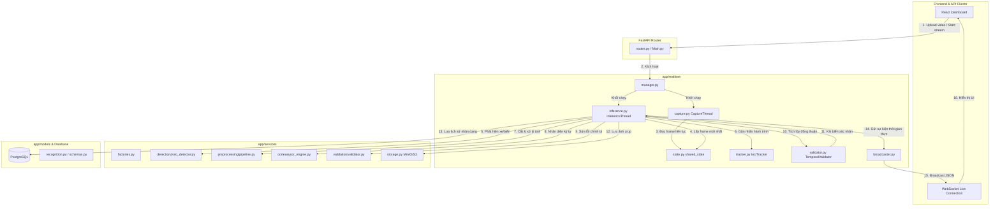

# Kiến Trúc Hệ Thống Nhận Diện Biển Số Xe Thời Gian Thực

Tài liệu này mô tả chi tiết kiến trúc, chức năng của từng tệp tin và luồng đi của dữ liệu (input/output) trong 3 thư mục cốt lõi của backend: `apps/api/app/models`, `apps/api/app/services` và `apps/api/app/realtime`.

Hệ thống được thiết kế theo mô hình phân lớp tách biệt (Decoupled/Layered Architecture), đảm bảo tính độc lập giữa lưu trữ dữ liệu (Database Models), dịch vụ xử lý không trạng thái (Stateless ML Services) và luồng xử lý video trực tuyến có trạng thái (Stateful Real-Time Pipeline).

---

## 1. Tổng Quan Kiến Trúc & Sơ Đồ Khối



---

## 2. Chi Tiết Từng File & Thư Mục

### 2.1. Thư mục `app/models` (Quản lý Schema & Lưu Trữ DB)

Thư mục này chịu trách nhiệm định nghĩa các cấu trúc dữ liệu lưu xuống cơ sở dữ liệu và cấu trúc đầu vào/đầu ra của API HTTP.

| Tên File | Chức Năng Chi Tiết | Input chính | Output chính |
| :--- | :--- | :--- | :--- |
| [recognition.py](file:///home/leduc1009/BTL_AIT2004-2/apps/api/app/models/recognition.py) | **Database Entity Model**: Định nghĩa bảng SQL `recognition_requests` dùng SQLAlchemy ORM để lưu trữ kết quả nhận diện (ảnh xe, biển số, tọa độ bbox, độ tin cậy, thông tin metadata của nguồn video). | Lệnh ghi/cập nhật bản ghi từ FastAPI router hoặc luồng inference. | Bảng cơ sở dữ liệu `recognition_requests` trong PostgreSQL. |
| [schemas.py](file:///home/leduc1009/BTL_AIT2004-2/apps/api/app/models/schemas.py) | **Pydantic Schemas**: Định nghĩa cấu trúc JSON phục vụ việc kiểm tra đầu vào và định dạng đầu ra của các HTTP REST API (ví dụ: danh sách lịch sử nhận diện, phân trang, thông tin trạng thái sức khỏe hệ thống `/health`). | Dữ liệu thô từ database hoặc request payload. | JSON được chuẩn hóa gửi về phía Client. |

---

### 2.2. Thư mục `app/services` (Các Dịch Vụ Stateless Machine Learning)

Thư mục này chứa các thành phần xử lý học máy không trạng thái. Mỗi dịch vụ xử lý độc lập trên từng ảnh tĩnh/vùng ảnh cắt ra, không quan tâm tới yếu tố thời gian hoặc lịch sử frame trước đó.

#### A. Phát hiện đối tượng (Detection)
- **[detection/detector.py](file:///home/leduc1009/BTL_AIT2004-2/apps/api/app/services/detection/detector.py)**: Định nghĩa interface trừu tượng `PlateDetector` và cấu trúc dữ liệu `BoundingBox` (dùng trong xử lý logic ML).
- **[detection/yolo_detector.py](file:///home/leduc1009/BTL_AIT2004-2/apps/api/app/services/detection/yolo_detector.py)**: Cài đặt thuật toán phát hiện biển số/phương tiện sử dụng YOLOv8. Có các chức năng chính:
  - `detect`: Phát hiện biển số đơn lẻ bằng 3 cấp độ dự phòng (Tier 1: Nhận dạng biển số trực tiếp; Tier 2: Nhận dạng ô tô rồi tự tính toán cắt phần dưới; Tier 3: Trả về toàn bộ ảnh nếu không tìm thấy gì).
  - `detect_vehicles_and_plates`: Chạy song song YOLOv8n (COCO) để bắt phương tiện và YOLOv8 tùy chỉnh để bắt biển số, sau đó tính toán diện tích đè lên nhau (Intersection-over-Area > 50%) để gắn biển số vào đúng phương tiện tương ứng.
  - `crop_to_bbox`: Thực hiện cắt ảnh theo vùng bao được phát hiện. Tích hợp cơ chế tự động mở rộng viền thêm **5% diện tích lề** (Bbox Padding) nhằm tránh tình trạng mất nét chữ ở sát mép, tăng độ chính xác cho bộ OCR.

#### B. Nhận diện ký tự (OCR)
- **[ocr/engine.py](file:///home/leduc1009/BTL_AIT2004-2/apps/api/app/services/ocr/engine.py)**: Định nghĩa class trừu tượng `OCREngine` và cấu trúc kết quả nhận dạng `OCRResult`.
- **[ocr/easyocr_engine.py](file:///home/leduc1009/BTL_AIT2004-2/apps/api/app/services/ocr/easyocr_engine.py)**: Sử dụng EasyOCR để đọc text từ vùng ảnh biển số đã tiền xử lý. Áp dụng whitelist ký tự `A-Z0-9` và tự động loại bỏ các khoảng trắng hay ký tự lạ.

#### C. Tiền xử lý ảnh (Preprocessing)
Thư mục `app/services/preprocessing` cung cấp các thuật toán OpenCV nhằm làm sạch ảnh biển số bị mờ, tối, nghiêng trước khi chuyển sang cho OCR:
- **[deblur.py](file:///home/leduc1009/BTL_AIT2004-2/apps/api/app/services/preprocessing/deblur.py)**: Dùng ma trận lọc thông cao (High-pass filter Laplacian kernel) để làm sắc nét viền ảnh bị mờ chuyển động.
- **[enhance.py](file:///home/leduc1009/BTL_AIT2004-2/apps/api/app/services/preprocessing/enhance.py)**: Sử dụng CLAHE (Contrast Limited Adaptive Histogram Equalization) trên kênh màu sáng LAB để làm nổi rõ ký tự biển số ở điều kiện thiếu sáng hoặc lóa sáng.
- **[perspective.py](file:///home/leduc1009/BTL_AIT2004-2/apps/api/app/services/preprocessing/perspective.py)**: Tìm contour lớn nhất, phát hiện 4 góc biển và thực hiện phép biến đổi hình học (Warp Perspective) để đưa ảnh biển về dạng nhìn thẳng đứng thẳng hàng.
- **[quality.py](file:///home/leduc1009/BTL_AIT2004-2/apps/api/app/services/preprocessing/quality.py)**: Đánh giá nhanh độ nhòe (dựa trên biến thiên Laplacian) và độ tương phản của ảnh gốc để quyết định có cần kích hoạt tính năng làm mịn/làm rõ không.
- **[pipeline.py](file:///home/leduc1009/BTL_AIT2004-2/apps/api/app/services/preprocessing/pipeline.py)**: Điều phối toàn bộ quy trình trên, áp dụng linh hoạt theo các chế độ (Mặc định, Tấn công - Aggressive, Hiệu chỉnh góc - Perspective).

#### D. Chuẩn hóa & Kiểm Tra Định Dạng (Validation)
- **[validation/rules/base.py](file:///home/leduc1009/BTL_AIT2004-2/apps/api/app/services/validation/rules/base.py)**: Interface `PlateRule` kiểm thử định dạng biển.
- **[validation/rules/brazil.py](file:///home/leduc1009/BTL_AIT2004-2/apps/api/app/services/validation/rules/brazil.py)**: Cài đặt quy tắc kiểm tra biển số Brazil. Thực hiện đối khớp biểu thức chính quy (Regex) cho cả biển Mercosul (`AAA0A00` hoặc `AAA0000`) và biển cũ. Đồng thời chứa bảng ánh xạ sửa đổi sai số OCR (ví dụ: phát hiện chữ `O` ở vị trí phải là số thì tự động đổi thành số `0`, chữ `I` đổi thành số `1`, v.v.).
- **[validation/validator.py](file:///home/leduc1009/BTL_AIT2004-2/apps/api/app/services/validation/validator.py)**: Lớp trung gian `PlateValidator` nhận dạng vùng miền để nạp quy tắc kiểm định tương ứng (mặc định là vùng "BR").

#### E. Tiện ích quản lý khởi tạo & Lưu trữ
- **[factories.py](file:///home/leduc1009/BTL_AIT2004-2/apps/api/app/services/factories.py)**: Chứa các hàm tạo singleton (`@lru_cache`) cho các model phát hiện biển số, OCR, và validator giúp tăng tốc khởi tạo ở hàm `preload_ml_components` khi server FastAPI start.
- **[storage.py](file:///home/leduc1009/BTL_AIT2004-2/apps/api/app/services/storage.py)**: Quản lý ghi file ảnh cắt biển số/xe lên Local storage hoặc MinIO bucket.

---

### 2.3. Thư mục `app/realtime` (Trục Xử Lý Stream Trực Tuyến Stateful)

Đây là tầng xử lý có trạng thái (Stateful). Nó liên kết các frame ảnh tĩnh thành một chuỗi thời gian liên tục, duy trì định danh của từng xe đi qua camera và tích lũy thông tin nhận dạng.

- **[state.py](file:///home/leduc1009/BTL_AIT2004-2/apps/api/app/realtime/state.py)**: Chứa class `StreamState` (singleton `shared_state`). Nó sử dụng `threading.Lock` để đồng bộ hóa việc ghi frame mới nhất từ luồng đọc camera (`capture.py`) và đọc frame ra ở luồng phân tích (`inference.py`). Lớp này cũng quản lý cờ dừng luồng `stop_event` và lưu vết lỗi nếu mất tín hiệu camera.
- **[capture.py](file:///home/leduc1009/BTL_AIT2004-2/apps/api/app/realtime/capture.py)**: Chạy một luồng nền độc lập (`LPR-CaptureThread`). Sử dụng OpenCV `cv2.VideoCapture` để đọc frame thô từ Webcam (`0`), RTSP link, hoặc Video file. Nếu là video file, nó sẽ tự tính toán độ trễ dựa trên FPS gốc để giả lập tốc độ chạy thực tế, tránh tràn bộ nhớ đệm.
- **[tracker.py](file:///home/leduc1009/BTL_AIT2004-2/apps/api/app/realtime/tracker.py)**:
  - Khai báo class `Track`: Lưu giữ thông tin lịch sử của một phương tiện qua các frame (Track ID, tọa độ bounding box hiện tại của xe/biển, danh sách các ký tự OCR từng nhận diện được cùng độ tin cậy, trạng thái biển đã được xác nhận - `is_confirmed` hoặc bị loại bỏ - `is_rejected`).
  - Khai báo class `IoUTracker`: So sánh bounding box của các phương tiện được phát hiện ở frame hiện tại với các xe đang theo dõi từ các frame trước thông qua chỉ số IoU (Intersection-over-Union). Nếu khớp (IoU >= 0.3), hệ thống giữ nguyên Track ID đó và cập nhật tọa độ mới. Nếu không khớp xe nào, cấp một Track ID mới. Tự động loại bỏ các Track mất dấu quá 15 frame.
- **[validator.py](file:///home/leduc1009/BTL_AIT2004-2/apps/api/app/realtime/validator.py)**: Lớp `TemporalValidator` giải quyết bài toán rung lắc chữ/sai ký tự trên video. Thay vì lấy kết quả OCR của duy nhất 1 frame, nó tích lũy các chuỗi text OCR đọc được trên cùng một Track ID qua nhiều frame:
  - Lọc ra các ký tự ứng viên khớp đúng định dạng Regex (bằng cách dùng dịch vụ `PlateValidator`).
  - Áp dụng kỹ thuật biểu quyết đa số (majority voting): Nếu một chuỗi biển số hợp lệ xuất hiện tối thiểu `min_confirm_count` lần (mặc định là 3), biển số đó chính thức được xác nhận trạng thái `"confirmed"`.
  - Nếu đã thử tới `max_candidates` lần (mặc định là 8) mà không đạt đủ độ đồng thuận, biển số đó bị đánh dấu `"rejected"`.
- **[inference.py](file:///home/leduc1009/BTL_AIT2004-2/apps/api/app/realtime/inference.py)**: Luồng xử lý phân tích trung tâm (`LPR-InferenceThread`). Chạy liên tục trong nền:
  1. Đọc frame từ `shared_state`.
  2. Gửi ảnh qua `YoloPlateDetector` để phát hiện vùng chứa xe và biển số.
  3. Đưa tọa độ phát hiện được vào `IoUTracker` để cập nhật/gán Track ID.
  4. Với mỗi Track đang hoạt động ở frame này, nếu biển số chưa được xác nhận:
     - Cắt vùng ảnh chứa biển số (`crop_to_bbox` - tự động mở rộng lề 5% để cung cấp thêm bối cảnh viền cho OCR).
     - Gửi qua `PreprocessingPipeline` để tăng chất lượng ảnh.
     - Dùng `EasyOCREngine` để đọc text.
     - Đưa text và độ tin cậy vào `TemporalValidator` để cập nhật đồng thuận.
     - Nếu trạng thái chuyển sang `"confirmed"`: Lưu ảnh cắt vào MinIO, lưu bản ghi hoàn thành vào PostgreSQL database thông qua `async_session_factory`, đồng thời phát sự kiện `"plate.confirmed"` qua WebSocket.
  5. Giới hạn tần suất (mặc định tối đa 10 FPS) để mã hóa Base64 ảnh frame hiện tại kèm tọa độ bounding box đè lên và truyền phát sự kiện `"frame.processed"` qua WebSocket.
- **[broadcaster.py](file:///home/leduc1009/BTL_AIT2004-2/apps/api/app/realtime/broadcaster.py)**: Quản lý danh sách các kết nối WebSocket trực tuyến từ các dashboard client. Chuyển đổi dữ liệu sự kiện thời gian thực sang JSON và truyền phát (broadcast) song song đến toàn bộ client đang kết nối.
- **[manager.py](file:///home/leduc1009/BTL_AIT2004-2/apps/api/app/realtime/manager.py)**: Đóng vai trò điều phối tổng (StreamManager). Nhận lệnh từ API Router để khởi chạy hoặc dừng các luồng nền. Nó đảm bảo dọn dẹp tài nguyên thread cũ trước khi mở stream mới, đồng thời bắt giữ loop Asyncio hiện tại để truyền vào luồng Inference hỗ trợ gọi ngược (callback) lưu DB và phát WebSocket không đồng bộ.
- **[schemas.py](file:///home/leduc1009/BTL_AIT2004-2/apps/api/app/realtime/schemas.py)**: Định nghĩa các Pydantic schema dành riêng cho kết nối WebSocket và điều khiển stream (`WebSocketEvent`, `StreamStartRequest`, `StreamStatusResponse`).

---

## 3. Luồng Di Chuyển Của Dữ Liệu & Định Dạng Input/Output

### 3.1. Điểm Khởi Đầu: Luồng Đọc Ảnh (Capture Flow)
- **Input**: RTSP URL (`string`), Camera ID (`int` như `0`), hoặc Video File Path (`string`).
- **Xử lý**: `capture_thread_fn` đọc ảnh thô liên tiếp bằng OpenCV `cap.read()`.
- **Output**: Lưu trữ đối tượng ảnh NumPy Array `ndarray` kích thước `(H, W, 3)` kênh màu BGR và chỉ số tăng dần `frame_id` vào `shared_state`.

### 3.2. Điểm Phân Tích: Luồng Xử Xây Dựng (Inference Flow)
- **Input**: NumPy Array `ndarray` (Frame ảnh thô) từ `shared_state`.
- **Phát hiện xe & biển số**:
  - Gửi tới `detect_vehicles_and_plates(image)`.
  - **Output của bộ Detector**: Danh sách các `dict` chứa liên kết xe-biển dạng:
    ```python
    {
        "vehicle_bbox": BoundingBox(x, y, w, h, confidence, class_name),
        "plate_bbox": BoundingBox(x, y, w, h, confidence, class_name),
        "vehicle_conf": float,
        "plate_conf": float,
        "class_name": "car" | "truck" | "bus" | "motorcycle"
    }
    ```
- **Theo vết phương tiện (Tracking)**:
  - Gửi danh sách phát hiện trên vào `IoUTracker.update(detections, frame_id)`.
  - **Output của Tracker**: Bản đồ `dict` ánh xạ giữa `track_id` (số nguyên) và tọa độ bounding box hiện tại của xe.
- **Nhận dạng và đồng thuận (OCR & Temporal Validation)**:
  - Cắt vùng biển số dựa trên `plate_bbox` -> Đưa qua `PreprocessingPipeline.run(crop)` -> Trả về `PreprocessingResult` (ảnh đã lọc mịn và xoay thẳng).
  - Gửi ảnh lọc mịn tới `EasyOCREngine.read(preprocessed_image)` -> Trả về `OCRResult(text, confidence)`.
  - Gửi kết quả chữ đọc được tới `TemporalValidator.add_candidate(track, text, confidence)`:
    - Trùng khớp biểu thức chính quy của `PlateValidator.validate(text)` -> Đánh giá `is_valid` của ký tự.
    - Đếm số lần xuất hiện của text hợp lệ trên Track.
  - **Output của Temporal Validator**: Bộ tuple trạng thái: `(status, plate_text, average_confidence)`. Trong đó `status` có các trạng thái: `"pending"`, `"confirmed"`, hoặc `"rejected"`.

### 3.3. Điểm Đầu Ra: Lưu Trữ & Truyền Phát (Persistence & Broadcast Flow)
- Khi `status` chuyển sang `"confirmed"`:
  - **Lưu trữ ảnh**: Ảnh frame thô được nén JPG -> Lưu qua `StorageService.save(filename, bytes)` -> Nhận về `image_url` (URL truy cập từ xa).
  - **Lưu database**: Ghi bản ghi `RecognitionRequest` vào DB qua SQLAlchemy:
    - *Input*: `id` (UUID), `image_url`, `plate_number` (text biển số đồng thuận), `confidence_score` (phần trăm độ tin cậy trung bình), `bounding_box` (JSON tọa độ), `status` (`"COMPLETED"`).
  - **WebSocket Broadcast**:
    - *Input*: Đối tượng `WebSocketEvent` sự kiện chứa đầy đủ dữ liệu nhận diện biển confirmed.
    - *Output*: Broadcast chuỗi JSON dạng:
      ```json
      {
        "type": "plate.confirmed",
        "timestamp": "2026-06-23T15:26:42+07:00",
        "camera_id": "cam-01",
        "frame_id": 124,
        "track_id": 3,
        "plate_text": "ABC1D23",
        "confidence": 92,
        "vehicle_conf": 98,
        "plate_conf": 95,
        "bbox": {"x": 120, "y": 340, "width": 80, "height": 30}
      }
      ```
- Định kỳ theo giây (để hiển thị luồng live lên UI):
  - Luồng Inference nén ảnh frame JPG độ phân giải thấp hơn, mã hóa Base64 chuỗi ảnh và đính kèm danh sách các biển số đang hiển thị trên khung hình ở frame hiện tại (bao gồm trạng thái `"pending"`, `"confirmed"` hay `"rejected"` tương ứng của từng Track).
  - **WebSocket Output**:
    ```json
    {
      "type": "frame.processed",
      "timestamp": "2026-06-23T15:26:42+07:00",
      "camera_id": "cam-01",
      "frame_id": 124,
      "image_base64": "/9j/4AAQSkZJRgABAQAAAQABAAD...",
      "fps": 29.5,
      "data": {
        "detections": [
          {
            "track_id": 3,
            "vehicle_bbox": {"x": 20, "y": 45, "width": 30, "height": 50},
            "plate_bbox": {"x": 32, "y": 78, "width": 10, "height": 5},
            "status": "confirmed",
            "text": "ABC1D23",
            "vehicle_confidence": 98,
            "plate_confidence": 95,
            "ocr_confidence": 92,
            "confidence": 92
          }
        ]
      }
    }
    ```
- Khi video kết thúc hoặc mất kết nối:
  - Cập nhật trạng thái của yêu cầu nhận diện gốc trong database thành `"COMPLETED"` hoặc `"FAILED"`.
  - Broadcast sự kiện `"stream.stopped"` thông báo cho Client để chuyển trạng thái UI sang chế độ tĩnh.
