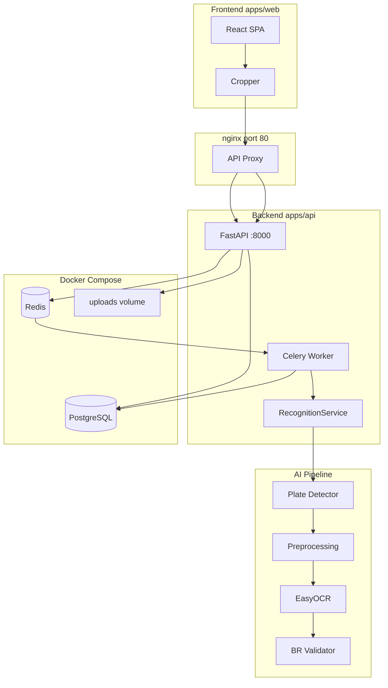
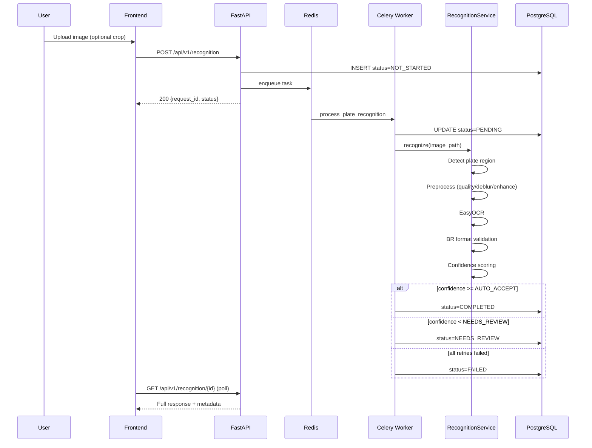

# Target Architecture — License Plate Recognition

## System Overview



## Monorepo Layout (Target)

```
license-plate-recognition/
├── apps/
│   ├── api/                    # FastAPI + Celery + ML services
│   │   ├── app/
│   │   │   ├── main.py
│   │   │   ├── api/routes.py
│   │   │   ├── models/
│   │   │   ├── services/
│   │   │   │   ├── detection/
│   │   │   │   ├── ocr/
│   │   │   │   ├── preprocessing/
│   │   │   │   ├── validation/
│   │   │   │   ├── recognition.py
│   │   │   │   └── storage.py
│   │   │   ├── worker/
│   │   │   └── shared/
│   │   ├── migrations/
│   │   ├── Dockerfile
│   │   ├── Makefile
│   │   ├── requirements.txt
│   │   └── .env.example
│   └── web/                    # React/Vite SPA
│       ├── src/
│       ├── Dockerfile
│       └── nginx.conf
├── models/                     # DVC-tracked weights
│   ├── detection/
│   ├── onnx/
│   └── release/
├── datasets/                   # Training/eval data (gitignored raw)
├── notebooks/                  # ML exploration
├── scripts/                    # CI, smoke test, backup
├── plan/                       # Agile redesign docs (this folder)
├── data/                       # Docker volumes (gitignored)
├── docker-compose.yml
├── docker-compose.dev.yml
├── Makefile                    # Root wrapper
└── .env.example
```

## Recognition Pipeline Flow



## Component Responsibilities

| Component | Owner | Responsibility |
|-----------|-------|----------------|
| `apps/web` | Frontend | Upload UI, crop, list, detail, polling, review UX |
| `apps/api/app/api` | Backend | REST endpoints, validation, error handling |
| `apps/api/app/worker` | Backend | Celery tasks, status lifecycle |
| `apps/api/app/services/recognition.py` | Backend + AI | Orchestrate ML pipeline |
| `apps/api/app/services/detection/` | AI | YOLO / ONNX plate detection |
| `apps/api/app/services/ocr/` | AI | EasyOCR integration |
| `apps/api/app/services/preprocessing/` | AI | Image enhancement pipeline |
| `apps/api/app/services/validation/` | AI | Brazilian plate rules |
| `docker-compose.yml` | DevOps | Service orchestration |
| `models/` | AI + DevOps | Versioned weights via DVC |

## Data Model (Target)

### `recognition_requests` table

| Column | Type | Description |
|--------|------|-------------|
| `id` | UUID PK | Request identifier |
| `image_url` | VARCHAR | Path/URL to stored image |
| `plate_number` | VARCHAR NULL | Recognized plate text |
| `status` | ENUM | NOT_STARTED, PENDING, COMPLETED, NEEDS_REVIEW, FAILED |
| `error_message` | TEXT NULL | Error detail if FAILED |
| `confidence_score` | FLOAT NULL | Combined confidence 0–1 |
| `detection_confidence` | FLOAT NULL | Detector confidence |
| `ocr_confidence` | FLOAT NULL | OCR confidence |
| `needs_review` | BOOLEAN | Auto-flag for manual review |
| `bounding_box` | JSON NULL | `{x, y, width, height}` |
| `plate_region` | VARCHAR NULL | e.g. `BR` |
| `created_at` | TIMESTAMP | Created |
| `updated_at` | TIMESTAMP | Last updated |

## API Surface (Summary)

Full contract: [`05-api-contracts.md`](05-api-contracts.md)

| Method | Path | Description |
|--------|------|-------------|
| GET | `/health` | Health check (+ extended deps in Sprint 2) |
| POST | `/api/v1/recognition` | Upload image, queue task |
| GET | `/api/v1/recognition/{id}` | Get request detail |
| GET | `/api/v1/recognition` | Paginated list |
| POST | `/api/v1/recognition/{id}/reprocess` | Re-queue FAILED/NEEDS_REVIEW |
| GET | `/uploads/{filename}` | Static image serve |

## Environment Profiles

| Profile | Command | Use case |
|---------|---------|----------|
| `infra-only` | `docker compose up db redis` | Local dev, API/worker chạy ngoài container |
| `dev` | `docker compose -f docker-compose.yml -f docker-compose.dev.yml up` | Hot reload |
| `prod-like` | `docker compose --profile prod up` | Pre-release validation |

## Integration Points (Cross-team)

| Interface | Producer | Consumer | Contract |
|-----------|----------|----------|----------|
| REST API | Backend | Frontend | OpenAPI `/docs` |
| ML output schema | AI | Backend | JSON spec in Sprint 3 AI |
| Model artifacts | AI | DevOps | `models/release/v1.0/` |
| Env variables | DevOps | All | [`06-env-variables.md`](06-env-variables.md) |
| Docker services | DevOps | All | `docker-compose.yml` healthchecks |

## Non-Functional Requirements

| NFR | Target |
|-----|--------|
| Availability (local) | 5 services healthy after `docker compose up` |
| Latency p95 | Upload → COMPLETED < 30s |
| Scalability (local) | 10 concurrent uploads (locust spike) |
| Observability | Structured JSON logs, request ID propagation |
| Security (local) | No secrets in git, `.env` gitignored |
| Maintainability | Pre-commit hooks, CI script, ≥ 70% backend coverage |
