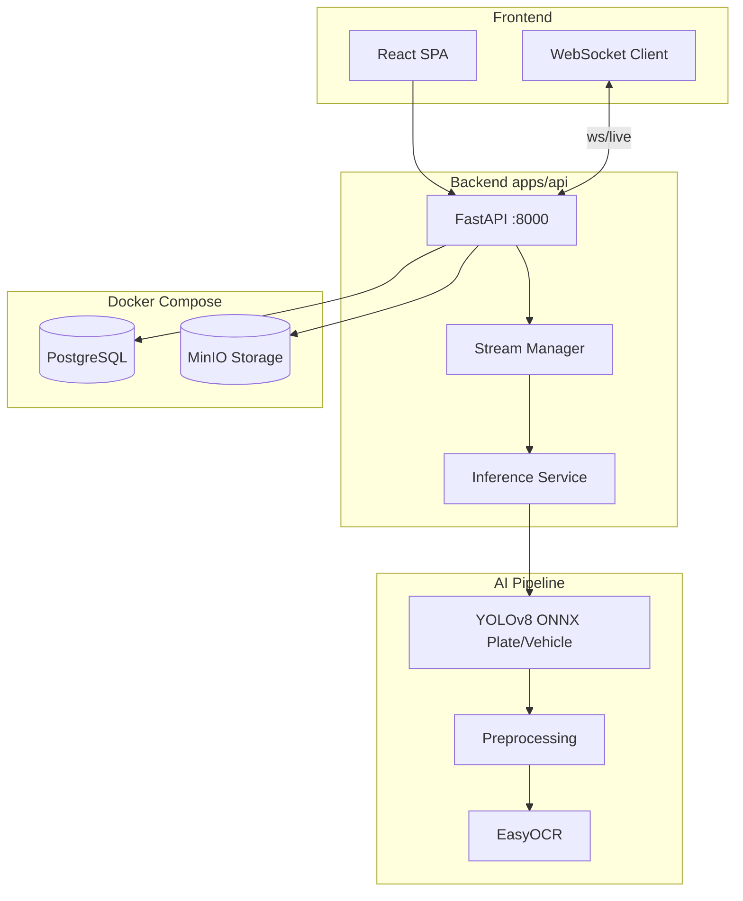
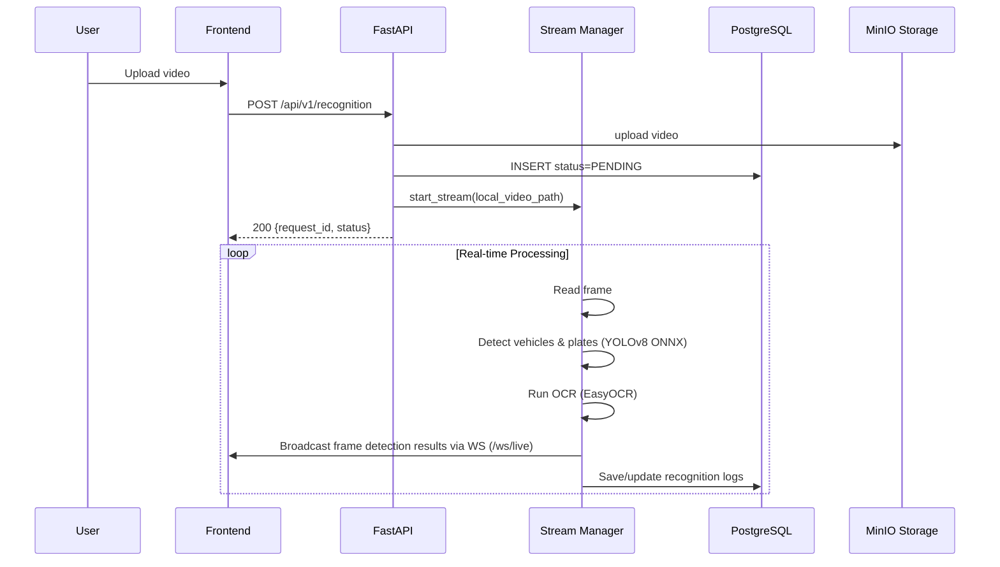

# Target Architecture — License Plate Recognition

## System Overview



## Monorepo Layout (Target)

```
license-plate-recognition/
├── apps/
│   └── api/                    # FastAPI + ML services
│       ├── app/
│       │   ├── main.py
│       │   ├── api/routes.py
│       │   ├── models/
│       │   ├── realtime/       # WebSockets & Stream management
│       │   ├── services/       # Storage Service
│       │   └── shared/         # Database, Config, Logger
│       ├── migrations/
│       ├── Dockerfile
│       ├── Makefile
│       ├── requirements.txt
│       └── .env.example
├── frontend/                   # React/Vite SPA
│   ├── src/
│   ├── Dockerfile
│   └── index.html
├── models/                     # Model weights
│   └── onnx/                   # yolov8-plate-v1.onnx, yolov8n.onnx
├── scripts/                    # CI, smoke test, backup
├── plan/                       # Agile redesign docs (this folder)
├── docker-compose.yml
├── Makefile                    # Root wrapper
└── .env.example
```

## Recognition Pipeline Flow



## Component Responsibilities

| Component | Owner | Responsibility |
|-----------|-------|----------------|
| `frontend` | Frontend | Upload UI, stream display, logs, WebSockets, review UX |
| `apps/api/app/api` | Backend | REST endpoints, WebSocket connections, validation |
| `apps/api/app/realtime` | Backend | Stream management, inference scheduling, broadcasting |
| `apps/api/app/services/` | Backend | MinIO / local storage integration |
| `apps/api/app/shared/` | Backend | DB context, configuration, logging |
| `docker-compose.yml` | DevOps | PostgreSQL, MinIO, API, Frontend orchestration |

## Data Model (Target)

### `recognition_requests` table

| Column | Type | Description |
|--------|------|-------------|
| `id` | UUID PK | Request identifier |
| `image_url` | VARCHAR | Path/URL to stored image |
| `plate_number` | VARCHAR NULL | Recognized plate text |
| `status` | ENUM | NOT_STARTED, PENDING, COMPLETED, NEEDS_REVIEW, FAILED |
| `error_message` | TEXT NULL | Error detail if FAILED |
| `confidence_score` | FLOAT NULL | Combined confidence 0–1 |
| `detection_confidence` | FLOAT NULL | Detector confidence |
| `ocr_confidence` | FLOAT NULL | OCR confidence |
| `needs_review` | BOOLEAN | Auto-flag for manual review |
| `bounding_box` | JSON NULL | `{x, y, width, height}` |
| `plate_region` | VARCHAR NULL | e.g. `BR` |
| `created_at` | TIMESTAMP | Created |
| `updated_at` | TIMESTAMP | Last updated |

## API Surface (Summary)

Full contract: [`05-api-contracts.md`](05-api-contracts.md)

| Method | Path | Description |
|--------|------|-------------|
| POST | `/api/v1/recognition` | Upload video, lưu trữ và kích hoạt stream processing |
| GET | `/api/v1/recognition/{id}` | Lấy chi tiết kết quả nhận diện |
| GET | `/api/v1/recognition` | Danh sách lịch sử nhận diện (phân trang) |
| DELETE | `/api/v1/recognition/{id}` | Xóa bản ghi lịch sử và file tương ứng |
| POST | `/api/v1/streams/start` | Bắt đầu một luồng xử lý video realtime |
| POST | `/api/v1/streams/stop` | Dừng luồng xử lý realtime |
| GET | `/api/v1/streams/status` | Lấy trạng thái luồng realtime hiện tại |
| WS | `/ws/live` | Kết nối WebSocket nhận frame realtime từ backend |

## Environment Profiles

| Profile | Command | Use case |
|---------|---------|----------|
| `full-stack` | `docker compose up -d` | Chạy toàn bộ hệ thống (db, minio, api, frontend) |
| `infra-only` | `docker compose up -d db minio` | Chạy hạ tầng để debug API & Frontend cục bộ bên ngoài |

## Integration Points (Cross-team)

| Interface | Producer | Consumer | Contract |
|-----------|----------|----------|----------|
| REST API & WS | Backend | Frontend | OpenAPI `/docs` & WebSocket events |
| ML output schema | AI | Backend | JSON result per frame |
| Model weights | AI | Backend | `models/onnx/*.onnx` |
| Env variables | DevOps | All | [`06-env-variables.md`](06-env-variables.md) |
| Docker services | DevOps | All | `docker-compose.yml` healthchecks |

## Non-Functional Requirements

| NFR | Target |
|-----|--------|
| Availability (local) | 4 services (db, minio, api, frontend) khởi động healthy dưới 3 phút |
| Latency p95 | Xử lý frame video AI dưới 150ms/frame |
| WebSockets | Hỗ trợ phát frame realtime mượt mà lên giao diện |
| Observability | Log có cấu trúc trên API console |
| Security (local) | Thông tin nhạy cảm cấu hình qua file `.env` không commit |
| Maintainability | Code sạch, cấu trúc rõ ràng, hỗ trợ migrate DB qua Alembic |
