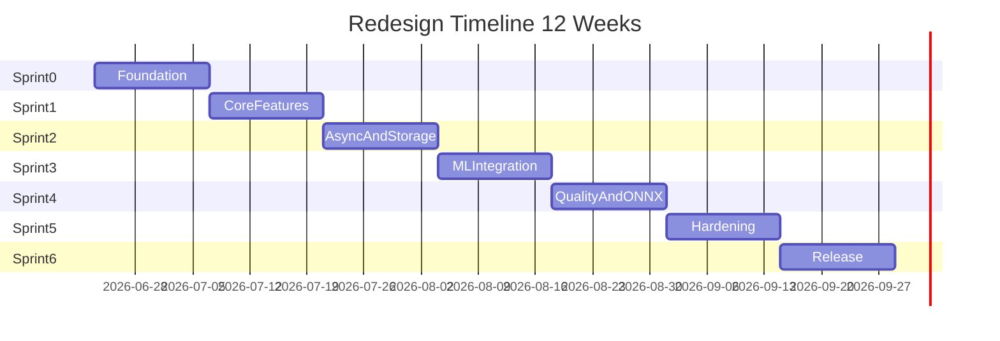

# Sprint Calendar — 12 Weeks (6 Sprints)

**Start date:** 2026-06-23 (Monday)  
**Sprint length:** 2 weeks (10 working days)  
**Deploy target:** Local + Docker Compose

## Timeline Overview

## Sprint Schedule

| Sprint | Dates | Theme | Sprint Goal |
|--------|-------|-------|-------------|
| **0** | 2026-06-23 → 2026-07-06 | Foundation | Clone repo → DB + Redis + API health + Vite dev |
| **1** | 2026-07-07 → 2026-07-20 | Core Features | CRUD API + upload UI + detection baseline |
| **2** | 2026-07-21 → 2026-08-03 | Async & Storage | Celery worker + list/detail + observability |
| **3** | 2026-08-04 → 2026-08-17 | ML Integration | Full pipeline + Docker full stack + confidence UI |
| **4** | 2026-08-18 → 2026-08-31 | Quality & ONNX | CI/pre-commit + ONNX inference + review workflow |
| **5** | 2026-09-01 → 2026-09-14 | Hardening | Rate limit, backup, eval benchmark, UX polish |
| **6** | 2026-09-15 → 2026-09-28 | Release | E2E tests, performance baseline, v1.0 handoff |

## Ceremonies (Each Sprint)

| Ceremony | When | Duration | Participants | Output |
|----------|------|----------|--------------|--------|
| Sprint Planning | Day 1 (Mon) | 2h | All tracks | Sprint backlog committed |
| Daily Standup | Daily 9:30 | 15min | All tracks | Blockers → integration file |
| Backlog Refinement | Day 5 (mid-sprint) | 1h | Track leads | Next sprint prep |
| Sprint Review | Day 10 (Fri w2) | 1h | All + stakeholders | Demo recording |
| Retrospective | Day 10 (after review) | 45min | All tracks | Action items, risk update |

## Milestones & Demo Dates

| Date | Milestone | Demo focus |
|------|-----------|------------|
| 2026-07-06 | M0 — Dev environment ready | `make docker-up`, `/health`, Vite loads |
| 2026-07-20 | M1 — Upload works | Upload image → see request in list |
| 2026-08-03 | M2 — Async processing | Upload → poll → plate result |
| 2026-08-17 | M3 — Full stack Docker | `docker compose up` all 5 services |
| 2026-08-31 | M4 — Quality gates | CI green, ONNX flag, review UI |
| 2026-09-14 | M5 — Hardening complete | Backup/restore, load test report |
| 2026-09-28 | M6 — v1.0 Release | Full E2E, metrics report, handoff doc |

## Track Focus per Sprint

| Sprint | DevOps | AI Engineer | Backend | Frontend |
|--------|--------|-------------|---------|----------|
| 0 | Monorepo, compose db/redis | Data baseline | FastAPI scaffold | Vite scaffold |
| 1 | Full docker stack | Detection pipeline | API CRUD | Upload flow |
| 2 | Observability | OCR/preprocessing | Celery worker | Request list |
| 3 | Model artifacts | Validation/confidence | Storage + reprocess | Detail + confidence |
| 4 | CI/quality gates | ONNX optimization | ML integration | Review workflow |
| 5 | Hardening/backup | Evaluation benchmark | API hardening | UX polish |
| 6 | Release | Model handoff | E2E tests | Playwright QA |

## Integration Files

Mỗi sprint có file tích hợp cross-team:

- [`../sprints/sprint-0-integration.md`](../sprints/sprint-0-integration.md)
- [`../sprints/sprint-1-integration.md`](../sprints/sprint-1-integration.md)
- [`../sprints/sprint-2-integration.md`](../sprints/sprint-2-integration.md)
- [`../sprints/sprint-3-integration.md`](../sprints/sprint-3-integration.md)
- [`../sprints/sprint-4-integration.md`](../sprints/sprint-4-integration.md)
- [`../sprints/sprint-5-integration.md`](../sprints/sprint-5-integration.md)
- [`../sprints/sprint-6-integration.md`](../sprints/sprint-6-integration.md)

## Holiday / Buffer Notes

- Nếu sprint bị slip > 2 ngày: ưu tiên Sprint Goal, defer stretch goals
- Stretch goals đánh dấu `(stretch)` trong sprint checklists
- Sprint 6 có 2 ngày buffer cho release fixes trước demo cuối
