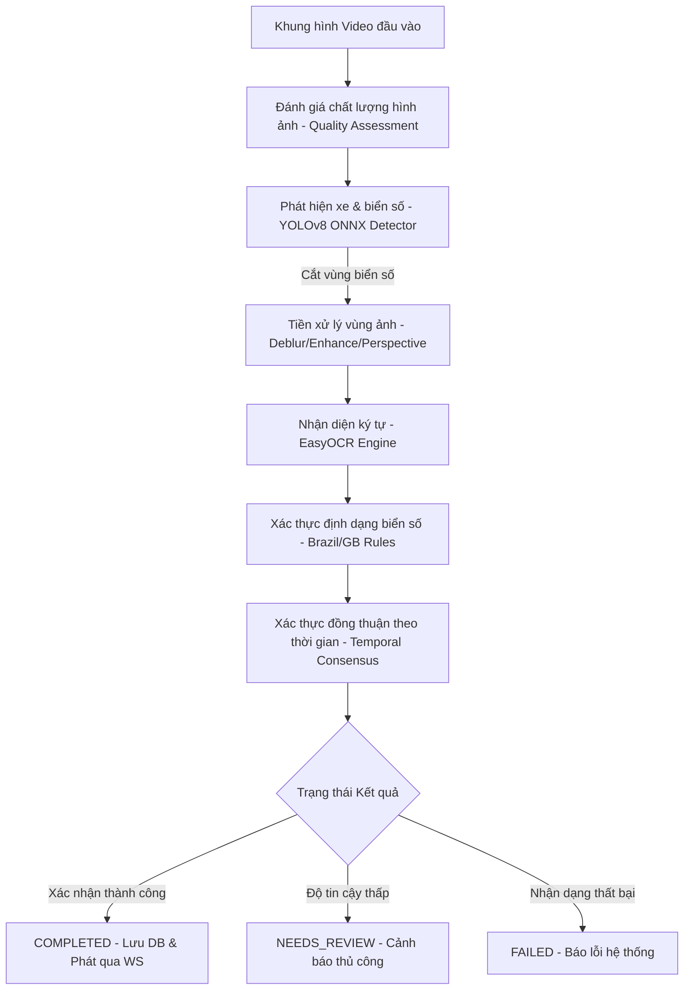

# Báo Cáo Kỹ Thuật: Nhánh AI Engineer
**Dự án:** Nhận diện Biển Số Xe (License Plate Recognition)  
**Tác giả:** AI Engineering Team  
**Ngày lập:** 24/06/2026  
**Trạng thái:** Bản phác thảo Thiết kế & Hiện trạng Sprint 0  

---

## 📌 Mục lục
1. [Tổng quan về AI Pipeline](#1-tổng-quan-về-ai-pipeline)
2. [Chi tiết Phát hiện Đối tượng (Detection)](#2-chi-tiết-phát-hiện-đối-tượng-detection)
3. [Tiền xử lý vùng Biển Số (Preprocessing)](#3-tiền-xử-lý-vùng-biển-số-preprocessing)
4. [Bộ nhận diện Ký tự (OCR Engine)](#4-bộ-nhận-diện-ký-tự-ocr-engine)
5. [Hậu xử lý, Xác thực & Theo vết (Post-processing, Validation & Tracking)](#5-hậu-xử-lý-xác-thực--theo-vết-post-processing-validation--tracking)
6. [Kế hoạch Sprint & Tiêu chí DoD (AI Track Sprints)](#6-kế-hoạch-sprint--tiêu-chí-dod-ai-track-sprints)
7. [Bản đồ liên kết File & Ký hiệu Code](#7-bản-đồ-liên-kết-file--ký-hiệu-code)

---

## 1. Tổng quan về AI Pipeline

AI Pipeline của hệ thống được thiết kế theo mô hình xử lý tuần tự động và tối ưu hóa thời gian thực (Real-time Stream Pipeline), phục vụ bài toán nhận diện biển số xe (đặc biệt là định dạng Mercosul của Brazil và định dạng của Vương quốc Anh). 

Quy trình xử lý một khung hình (Frame) đầu vào như sau:

---

## 2. Chi tiết Phát hiện Đối tượng (Detection)

Hệ thống sử dụng mô hình YOLOv8 được tối ưu hóa sang định dạng ONNX chạy thông qua ONNX Runtime để phát hiện phương tiện (xe hơi, xe máy, xe buýt, xe tải) và biển số xe. Lớp xử lý chính là [OnnxPlateDetector](file:///d:/MySC/Python/BTL_AIT2004-2/apps/api/app/services/detection/onnx_detector.py#L48).

### 2.1. Kiến trúc suy diễn 3 tầng (Three-Tier Fallback Architecture)
Để tăng độ tin cậy khi nhận diện, [OnnxPlateDetector.detect](file:///d:/MySC/Python/BTL_AIT2004-2/apps/api/app/services/detection/onnx_detector.py#L249) áp dụng kiến trúc fallback 3 tầng như sau:
1. **Tier 1 (Plate Detection):** Sử dụng mô hình tùy chỉnh YOLOv8 biển số ([yolov8-plate-v1.onnx](file:///d:/MySC/Python/BTL_AIT2004-2/apps/api/models/onnx/yolov8-plate-v1.onnx)) để trực tiếp phát hiện bounding box của biển số xe.
2. **Tier 2 (Vehicle Detection):** Nếu Tier 1 không tìm thấy biển số, hệ thống sẽ sử dụng mô hình COCO ([yolov8n.onnx](file:///d:/MySC/Python/BTL_AIT2004-2/apps/api/models/onnx/yolov8n.onnx)) để tìm phương tiện. Sau đó, hệ thống tự động suy diễn vùng chứa biển số dựa trên giả định hình học (biển số thường nằm ở phần dưới, khoảng 70% chiều cao của xe).
3. **Tier 3 (Full Image Fallback):** Nếu cả phương tiện lẫn biển số đều không được phát hiện, hệ thống sẽ fallback về việc sử dụng toàn bộ ảnh làm vùng chứa biển số để đưa qua bộ OCR.

### 2.2. Liên kết Phương tiện và Biển số (Vehicle-Plate Association)
Hàm [OnnxPlateDetector.detect_vehicles_and_plates](file:///d:/MySC/Python/BTL_AIT2004-2/apps/api/app/services/detection/onnx_detector.py#L275) chịu trách nhiệm liên kết biển số xe vào đúng phương tiện tương ứng thông qua tính toán độ trùng khớp diện tích Intersection over Union (IoU) giữa vùng biển số và vùng phương tiện:
- Nếu chỉ số overlap diện tích giao nhau trên diện tích biển số $> 0.5$, biển số đó sẽ được gán cho phương tiện.
- Nếu phương tiện không có biển số nào khớp, vùng biển số giả định sẽ được tạo ở cận dưới của phương tiện.
- Nếu phát hiện biển số mồ côi (không có xe tương ứng), hệ thống sẽ tạo một hộp bao xe mô phỏng xung quanh biển số để hiển thị trực quan lên giao diện người dùng.

### 2.3. Tối ưu hóa suy diễn ONNX Runtime
- **Execution Providers (EP):** Trình phát hiện thăm dò và ưu tiên sử dụng các EP phần cứng theo thứ tự: `TensorrtExecutionProvider` (NVIDIA TensorRT) -> `CUDAExecutionProvider` (NVIDIA CUDA) -> `DmlExecutionProvider` (Windows DirectML) -> `CPUExecutionProvider` (CPU fallback).
- **Tiền xử lý Letterbox:** Khung hình đầu vào có kích thước bất kỳ được biến đổi qua hàm [letterbox](file:///d:/MySC/Python/BTL_AIT2004-2/apps/api/app/services/detection/onnx_detector.py#L26) để thay đổi kích thước và thêm phần đệm màu xám `(114, 114, 114)` về dạng tĩnh `640x640`. Sau đó, kênh màu được chuyển đổi từ BGR sang RGB, chuẩn hóa về khoảng `[0.0, 1.0]`, chuyển vị sang dạng CHW `(1, 3, 640, 640)` trước khi nạp vào phiên làm việc `ort.InferenceSession`.
- **Hậu xử lý Non-Maximum Suppression (NMS):** Kết quả suy diễn dạng tensor được chuyển vị và lọc bằng ngưỡng tin cậy (Confidence threshold), sau đó áp dụng hàm [cv2.dnn.NMSBoxes](file:///d:/MySC/Python/BTL_AIT2004-2/apps/api/app/services/detection/onnx_detector.py#L221) (NMS của OpenCV) với IOU threshold `0.45` để loại bỏ các hộp bao chồng chéo.

---

## 3. Tiền xử lý vùng Biển Số (Preprocessing)

Lớp [PreprocessingPipeline](file:///d:/MySC/Python/BTL_AIT2004-2/apps/api/app/services/preprocessing/pipeline.py#L25) thực hiện xử lý nâng cao chất lượng ảnh vùng biển số bị cắt (crop) nhằm tăng độ chính xác cho EasyOCR:
- **Quality Assessment:** Sử dụng thuật toán đánh giá độ mờ (Blur score) và độ tương phản thấp (Low contrast).
- **Deblur:** Áp dụng bộ lọc làm sắc nét ảnh khi ảnh bị nhòe thông qua [deblur](file:///d:/MySC/Python/BTL_AIT2004-2/apps/api/app/services/preprocessing/deblur.py).
- **Enhance:** Cân bằng biểu đồ xám CLAHE hoặc tăng độ tương phản thông qua [enhance](file:///d:/MySC/Python/BTL_AIT2004-2/apps/api/app/services/preprocessing/enhance.py).
- **Perspective Correction:** Hiệu chỉnh phối cảnh nghiêng bằng phép biến đổi Affine/Perspective thông qua [correct_perspective](file:///d:/MySC/Python/BTL_AIT2004-2/apps/api/app/services/preprocessing/perspective.py).
- **Chế độ hoạt động (PreprocessingMode):** 
  - `DEFAULT`: Chỉ kích hoạt bộ lọc làm sắc nét nếu ảnh mờ.
  - `AGGRESSIVE`: Ép buộc chạy Deblur và Enhance đồng thời để xử lý các vùng ảnh biển số chất lượng cực kém.
  - `PERSPECTIVE`: Tập trung hiệu chỉnh biến dạng phối cảnh nghiêng.

---

## 4. Bộ nhận diện Ký tự (OCR Engine)

Hệ thống tích hợp thư viện EasyOCR qua lớp [EasyOcrEngine](file:///d:/MySC/Python/BTL_AIT2004-2/apps/api/app/services/ocr/easyocr_engine.py). 

### Đặc điểm thiết kế:
- Hỗ trợ bật/tắt tăng tốc phần cứng thông qua cấu hình biến môi trường `OCR_GPU` (True/False).
- Đọc vùng ảnh biển số đã qua tiền xử lý, trả về chuỗi ký tự nhận diện kèm theo độ tự tin trung bình của các ký tự.
- Kết quả OCR bao gồm chuỗi ký tự thô và điểm số tin cậy từ `0.0` đến `1.0`.

---

## 5. Hậu xử lý, Xác thực & Theo vết (Post-processing, Validation & Tracking)

### 5.1. Xác thực định dạng & Tự sửa lỗi (Format Validation & OCR Correction)
Để giảm tỷ lệ sai sót của OCR, hệ thống áp dụng các quy tắc định dạng quốc gia. Điển hình là định dạng Brazil được thực hiện trong [BrazilPlateRule](file:///d:/MySC/Python/BTL_AIT2004-2/apps/api/app/services/validation/rules/brazil.py#L17):
- **Định dạng Brazil Mercosul:** Khớp với regex `^[A-Z]{3}[0-9][A-Z0-9][0-9]{2}$` (ví dụ: ABC1D23).
- **Định dạng Brazil Cũ:** Khớp với regex `^[A-Z]{3}[0-9]{4}$` (ví dụ: ABC1234).
- **Quy tắc tự sửa lỗi ký tự lỗi phổ biến (OCR Corrections):** Nếu biển số thô không khớp với định dạng chuẩn, thuật toán [BrazilPlateRule._apply_corrections](file:///d:/MySC/Python/BTL_AIT2004-2/apps/api/app/services/validation/rules/brazil.py#L56) sẽ tự động sửa các lỗi nhầm lẫn ký tự chữ/số thường gặp do OCR dựa trên vị trí ký tự trong chuỗi:
  - `O` chuyển thành `0` (ở các vị trí bắt buộc là số).
  - `I` chuyển thành `1`.
  - `Z` chuyển thành `2`.
  - `S` chuyển thành `5`.
  - `B` chuyển thành `8`.
- Nếu áp dụng quy tắc sửa lỗi mà chuỗi ký tự chuyển sang hợp lệ, kết quả xác thực sẽ trả về `is_valid=True` nhưng giảm điểm số validation xuống còn `0.8` (để phản ánh việc đã qua chỉnh sửa).

### 5.2. Theo vết đối tượng thời gian thực (Real-time Object Tracking)
Khi xử lý luồng stream video, hệ thống sử dụng bộ theo vết [IoUTracker](file:///d:/MySC/Python/BTL_AIT2004-2/apps/api/app/realtime/tracker.py#L43):
- Theo vết phương tiện qua các khung hình dựa trên độ trùng khớp hộp bao IoU giữa khung hình trước và khung hình sau (ngưỡng IoU tối thiểu `min_iou=0.3`).
- Quản lý vòng đời đối tượng thông qua lớp [Track](file:///d:/MySC/Python/BTL_AIT2004-2/apps/api/app/realtime/tracker.py#L23). Một đối tượng bị mất dấu quá `max_lost_frames=15` sẽ bị giải phóng khỏi danh sách theo vết.

### 5.3. Xác thực đồng thuận theo thời gian (Temporal Consensus Validation)
Nhận diện biển số trên một khung hình đơn lẻ có thể bị nhiễu. Lớp [TemporalValidator](file:///d:/MySC/Python/BTL_AIT2004-2/apps/api/app/realtime/validator.py#L8) giải quyết vấn đề này bằng cách thu thập kết quả OCR trên nhiều khung hình của cùng một đối tượng [Track](file:///d:/MySC/Python/BTL_AIT2004-2/apps/api/app/realtime/tracker.py#L23):
- Thu thập tối đa `max_candidates=8` kết quả nhận diện của một đối tượng qua các khung hình.
- Để tiết kiệm CPU, hệ thống chỉ chạy OCR với tần suất 1 lần mỗi 3 khung hình cho mỗi đối tượng.
- Thực hiện bỏ phiếu đa số (Majority Voting) trên các chuỗi ký tự hợp lệ.
- Biển số được xác nhận **"confirmed"** (và lưu vào CSDL) nếu một chuỗi ký tự đạt số lần xuất hiện tối thiểu `min_confirm_count=3` (trong mã hiện tại được tối ưu hóa chạy thử nghiệm ở mức `1`).
- Nếu tích lũy đủ `max_candidates=8` kết quả nhận dạng mà không đạt đồng thuận, đối tượng sẽ bị đánh dấu **"rejected"**.

---

## 6. Kế hoạch Sprint & Tiêu chí DoD (AI Track Sprints)

Tiến trình Agile của nhánh AI Engineer được hoạch định qua 7 Sprint (12 tuần):

- **Sprint 0 (Foundation - Hiện tại):** Thiết lập cấu trúc thư mục dữ liệu, viết tài liệu hướng dẫn gán nhãn, kiểm tra đánh giá ban đầu về dữ liệu mẫu có sẵn.
- **Sprint 1 (Detection Pipeline):** Huấn luyện/Chuyển đổi và kiểm thử mô hình YOLOv8 phát hiện biển số, tích hợp NMS và kiểm nghiệm độ chính xác sơ bộ.
- **Sprint 2 (OCR Preprocessing):** Thiết lập bộ EasyOCR, liên kết mã nguồn tiền xử lý (Deblur, Enhance, Perspective) và kiểm nghiệm khả năng tăng độ tương phản.
- **Sprint 3 (Validation & Confidence):** Áp dụng quy tắc xác thực biển số Brazil (Mercosul/Old) và xây dựng hệ thống chấm điểm độ tin cậy tổng hợp (Confidence scoring).
- **Sprint 4 (ONNX Optimization):** Tối ưu hóa suy diễn bằng cách xuất mô hình sang ONNX, triển khai phiên bản suy diễn với ONNX Runtime, so sánh hiệu năng và độ trễ (Latency benchmark).
- **Sprint 5 (Evaluation & Benchmark):** Chạy kiểm thử đánh giá chất lượng toàn diện trên tập dữ liệu kiểm thử đông băng (100 hình ảnh mẫu), thu thập số liệu báo cáo độ chính xác.
- **Sprint 6 (Model Handoff):** Đóng gói bộ trọng số mô hình ổn định nhất, viết tài liệu `MODEL_CARD.md` và bàn giao hoàn chỉnh cho nhánh Backend & DevOps.

### Tiêu chí nghiệm thu AI (Acceptance Criteria v1.0)
- Độ chính xác ký tự nhận diện (Char accuracy) đạt $\ge 90\%$ trên tập kiểm thử tĩnh 100 ảnh.
- Tỷ lệ biển số cần duyệt thủ công (Review rate) $\le 25\%$.
- Độ suy giảm độ chính xác của chế độ ONNX Runtime so với mô hình gốc PyTorch $\le 5\%$, đồng thời thời gian xử lý frame $\le 150ms/frame$ trên môi trường CPU Docker.

---

## 7. Bản đồ liên kết File & Ký hiệu Code

Dưới đây là các lớp và tệp tin quan trọng nhất cần lưu ý trong nhánh AI Engineer:

* **Phiên dịch suy diễn ONNX:** [onnx_detector.py](file:///d:/MySC/Python/BTL_AIT2004-2/apps/api/app/services/detection/onnx_detector.py) -> Lớp [OnnxPlateDetector](file:///d:/MySC/Python/BTL_AIT2004-2/apps/api/app/services/detection/onnx_detector.py#L48).
* **Tiền xử lý ảnh vùng biển:** [pipeline.py](file:///d:/MySC/Python/BTL_AIT2004-2/apps/api/app/services/preprocessing/pipeline.py) -> Lớp [PreprocessingPipeline](file:///d:/MySC/Python/BTL_AIT2004-2/apps/api/app/services/preprocessing/pipeline.py#L25).
* **Công cụ OCR ký tự:** [easyocr_engine.py](file:///d:/MySC/Python/BTL_AIT2004-2/apps/api/app/services/ocr/easyocr_engine.py) -> Lớp [EasyOcrEngine](file:///d:/MySC/Python/BTL_AIT2004-2/apps/api/app/services/ocr/easyocr_engine.py#L17).
* **Luật định dạng & Sửa lỗi Brazil:** [brazil.py](file:///d:/MySC/Python/BTL_AIT2004-2/apps/api/app/services/validation/rules/brazil.py) -> Lớp [BrazilPlateRule](file:///d:/MySC/Python/BTL_AIT2004-2/apps/api/app/services/validation/rules/brazil.py#L17).
* **Theo vết khung hình:** [tracker.py](file:///d:/MySC/Python/BTL_AIT2004-2/apps/api/app/realtime/tracker.py) -> Lớp [IoUTracker](file:///d:/MySC/Python/BTL_AIT2004-2/apps/api/app/realtime/tracker.py#L43) và [Track](file:///d:/MySC/Python/BTL_AIT2004-2/apps/api/app/realtime/tracker.py#L23).
* **Đồng thuận theo thời gian:** [validator.py](file:///d:/MySC/Python/BTL_AIT2004-2/apps/api/app/realtime/validator.py) -> Lớp [TemporalValidator](file:///d:/MySC/Python/BTL_AIT2004-2/apps/api/app/realtime/validator.py#L8).
