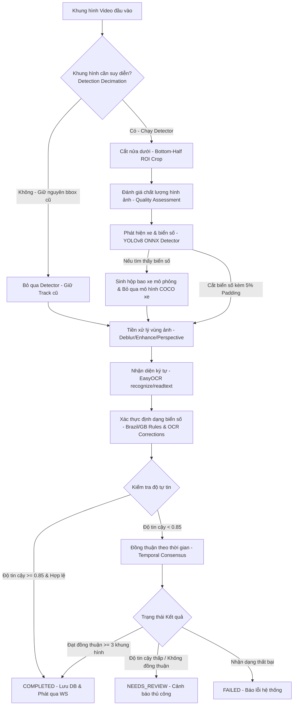

# Báo Cáo Kỹ Thuật: Nhánh AI Engineer & Cải Tiến Hiệu Năng
**Dự án:** Nhận diện Biển Số Xe (License Plate Recognition)  
**Tác giả:** AI Engineering Team  
**Ngày lập:** 24/06/2026  
**Trạng thái:** Thiết kế Chi tiết & Báo cáo Tối ưu hóa Sprint 0 & 1  

---

## 📌 Mục lục
1. [Tổng quan về AI Pipeline](#1-tổng-quan-về-ai-pipeline)
2. [Chi tiết Phát hiện Đối tượng (Detection) & Tối ưu hóa FPS](#2-chi-tiết-phát-hiện-đối-tượng-detection--tối-ưu-hóa-fps)
3. [Tiền xử lý vùng Biển Số (Preprocessing)](#3-tiền-xử-lý-vùng-biển-số-preprocessing)
4. [Bộ nhận diện Ký tự (OCR Engine) & Tối ưu hóa CPU](#4-bộ-nhận-diện-ký-tự-ocr-engine--tối-ưu-hóa-cpu)
5. [Hậu xử lý, Xác thực & Theo vết (Post-processing, Validation & Tracking)](#5-hậu-xử-lý-xác-thực--theo-vết-post-processing-validation--tracking)
6. [Kế hoạch Sprint, Tiêu chí DoD & Triển khai Docker](#6-kế-hoạch-sprint-tiêu-chí-dod--triển-khai-docker)
7. [Bản đồ liên kết File & Ký hiệu Code](#7-bản-đồ-liên-kết-file--ký-hiệu-code)

---

## 1. Tổng quan về AI Pipeline

AI Pipeline của hệ thống được thiết kế theo mô hình xử lý tuần tự động và tối ưu hóa thời gian thực (Real-time Stream Pipeline), phục vụ bài toán nhận diện biển số xe (đặc biệt là định dạng Mercosul của Brazil và định dạng của Vương quốc Anh). 

Để giải quyết triệt để tình trạng FPS thấp (1-2 FPS) và độ nhận dạng OCR kém trên môi trường CPU, hệ thống đã tích hợp thêm các bước tối ưu hóa luồng suy diễn và cấu hình thông minh:

---

## 2. Chi tiết Phát hiện Đối tượng (Detection) & Tối ưu hóa FPS

Hệ thống sử dụng mô hình YOLOv8 được tối ưu hóa sang định dạng ONNX chạy thông qua ONNX Runtime để phát hiện phương tiện (xe hơi, xe máy, xe buýt, xe tải) và biển số xe. Lớp xử lý chính là [OnnxPlateDetector](file:///home/leduc1009/BTL_AIT2004-2/apps/api/app/services/detection/onnx_detector.py#L48).

### 2.1. Kiến trúc suy diễn 3 tầng (Three-Tier Fallback Architecture) & Tối ưu hóa Bypass
Để tăng độ tin cậy khi nhận diện, [OnnxPlateDetector.detect](file:///home/leduc1009/BTL_AIT2004-2/apps/api/app/services/detection/onnx_detector.py#L249) áp dụng kiến trúc fallback 3 tầng như sau:
1. **Tier 1 (Plate Detection):** Sử dụng mô hình tùy chỉnh YOLOv8 biển số ([yolov8-plate-v1.onnx](file:///home/leduc1009/BTL_AIT2004-2/apps/api/models/onnx/yolov8-plate-v1.onnx)) để trực tiếp phát hiện bounding box của biển số xe.
   * **Tối ưu hóa Bypass:** Tái cấu trúc logic trong hàm `detect_vehicles_and_plates` của cả hai bộ phát hiện [yolo_detector.py](file:///home/leduc1009/BTL_AIT2004-2/apps/api/app/services/detection/yolo_detector.py) và [onnx_detector.py](file:///home/leduc1009/BTL_AIT2004-2/apps/api/app/services/detection/onnx_detector.py). Khi Tier 1 tìm thấy biển số, hệ thống sẽ tự động sinh hộp bao xe mô phỏng xung quanh biển số và **bỏ qua hoàn toàn forward pass của mô hình phát hiện xe COCO (`yolov8n.onnx`) ở Tier 2**. Việc này giúp tiết kiệm 1/2 tài nguyên suy diễn YOLO trên mỗi khung hình có biển số.
2. **Tier 2 (Vehicle Detection):** Nếu Tier 1 không tìm thấy biển số, hệ thống mới sử dụng mô hình COCO ([yolov8n.onnx](file:///home/leduc1009/BTL_AIT2004-2/apps/api/models/onnx/yolov8n.onnx)) để tìm phương tiện. Sau đó, hệ thống tự động suy diễn vùng chứa biển số dựa trên giả định hình học (biển số thường nằm ở phần dưới, khoảng 70% chiều cao của xe).
3. **Tier 3 (Full Image Fallback):** Nếu cả phương tiện lẫn biển số đều không được phát hiện, hệ thống sẽ fallback về việc sử dụng toàn bộ ảnh làm vùng chứa biển số để đưa qua bộ OCR.

### 2.2. Liên kết Phương tiện và Biển số (Vehicle-Plate Association)
Hàm [OnnxPlateDetector.detect_vehicles_and_plates](file:///home/leduc1009/BTL_AIT2004-2/apps/api/app/services/detection/onnx_detector.py#L275) chịu trách nhiệm liên kết biển số xe vào đúng phương tiện tương ứng thông qua tính toán độ trùng khớp diện tích Intersection over Union (IoU) giữa vùng biển số và vùng phương tiện:
- Nếu chỉ số overlap diện tích giao nhau trên diện tích biển số $> 0.5$, biển số đó sẽ được gán cho phương tiện.
- Nếu phương tiện không có biển số nào khớp, vùng biển số giả định sẽ được tạo ở cận dưới của phương tiện.
- Nếu phát hiện biển số mồ côi (không có xe tương ứng), hệ thống sẽ tạo một hộp bao xe mô phỏng xung quanh biển số để hiển thị trực quan lên giao diện người dùng.

### 2.3. Tối ưu hóa suy diễn ONNX Runtime
- **Execution Providers (EP):** Trình phát hiện thăm dò và ưu tiên sử dụng các EP phần cứng theo thứ tự: `TensorrtExecutionProvider` (NVIDIA TensorRT) -> `CUDAExecutionProvider` (NVIDIA CUDA) -> `DmlExecutionProvider` (Windows DirectML) -> `CPUExecutionProvider` (CPU fallback).
- **Tiền xử lý Letterbox:** Khung hình đầu vào có kích thước bất kỳ được biến đổi qua hàm [letterbox](file:///home/leduc1009/BTL_AIT2004-2/apps/api/app/services/detection/onnx_detector.py#L26) để thay đổi kích thước và thêm phần đệm màu xám `(114, 114, 114)` về dạng tĩnh `640x640`. Sau đó, kênh màu được chuyển đổi từ BGR sang RGB, chuẩn hóa về khoảng `[0.0, 1.0]`, chuyển vị sang dạng CHW `(1, 3, 640, 640)` trước khi nạp vào phiên làm việc `ort.InferenceSession`.
- **Hậu xử lý Non-Maximum Suppression (NMS):** Kết quả suy diễn dạng tensor được chuyển vị và lọc bằng ngưỡng tin cậy (Confidence threshold), sau đó áp dụng hàm [cv2.dnn.NMSBoxes](file:///home/leduc1009/BTL_AIT2004-2/apps/api/app/services/detection/onnx_detector.py#L221) (NMS của OpenCV) với IOU threshold `0.45` để loại bỏ các hộp bao chồng chéo.

### 2.4. Tối ưu hóa Tốc độ Khung hình (FPS) trên CPU
Để đạt mức xử lý mượt mà trên môi trường CPU của máy chủ thử nghiệm, hệ thống áp dụng hai cơ chế giảm tải phần cứng bổ sung:
1. **Tối ưu vùng nhận diện (Bottom-Half ROI Crop):**
   * **Cải tiến:** Áp dụng crop lấy nửa dưới của khung hình video (`bottom_half = frame[h // 2 :, :]`) trước khi đưa vào mô hình YOLOv8 trong [inference.py](file:///home/leduc1009/BTL_AIT2004-2/apps/api/app/realtime/inference.py).
   * **Kết quả:** Bỏ qua hoàn toàn các đối tượng ở xa hoặc không gian bầu trời ở nửa trên. Điều này giúp tối ưu hóa kích thước vùng đệm thực tế (actual content area) khi YOLO thực hiện letterbox, tăng độ rõ nét cho biển số xe ở vùng quét gần và cải thiện đáng kể tốc độ tiền xử lý hình ảnh. Hệ thống tự động bù tọa độ y của các hộp phát hiện (`y_original = y_cropped + h // 2`) và gọi hàm `clamp_to_image` để đảm bảo hiển thị đúng vị trí trên giao diện stream video của người dùng.
2. **Bỏ qua Khung hình Phát hiện (Detection Decimation):**
   * **Cải tiến:** Sử dụng cấu hình `DETECTION_DECIMATION` (mặc định là `2` hoặc `3`) trong [config.py](file:///home/leduc1009/BTL_AIT2004-2/apps/api/app/shared/config.py) và cải tiến luồng chính [inference.py](file:///home/leduc1009/BTL_AIT2004-2/apps/api/app/realtime/inference.py).
   * **Kết quả:** Bỏ qua hoàn toàn việc chạy mô hình phát hiện YOLO/ONNX ở các khung hình trung gian (chỉ chạy phát hiện 1 trong số $N$ khung hình). Trên các khung hình bị bỏ qua, hệ thống tiếp tục giữ nguyên tọa độ bboxes hiện tại của các phương tiện đang theo dõi thay vì chạy lại detector. Điều này giúp tăng tốc độ FPS trung bình lên gấp **2 lần (với decimation = 2)** hoặc **3 lần (với decimation = 3)** trên CPU mà không ảnh hưởng tới các thành phần hay logic nhận dạng OCR hiện tại.

---

## 3. Tiền xử lý vùng Biển Số (Preprocessing)

Trước khi thực hiện các phép xử lý nâng cao, hệ thống áp dụng kỹ thuật cắt mở rộng để đảm bảo thông tin biên:
- **Bbox Padding (Mở rộng viền cắt):** Các ký tự nằm sát biên của biển số dễ bị lỗi cắt phạm làm mất nét, khiến OCR nhận diện sai. Để khắc phục, hàm `crop_to_bbox` được nâng cấp để tự động thêm **5% diện tích lề** (padding = 0.05) theo cả 4 hướng của bounding box biển số được YOLO phát hiện. Việc tạo "khoảng thở" này giúp nét chữ ở mép ngoài cùng của biển số được giữ nguyên vẹn, cải thiện đáng kể độ chính xác của EasyOCR.

Lớp [PreprocessingPipeline](file:///home/leduc1009/BTL_AIT2004-2/apps/api/app/services/preprocessing/pipeline.py#L25) thực hiện xử lý nâng cao chất lượng ảnh vùng biển số bị cắt (crop) nhằm tăng độ chính xác cho EasyOCR:
- **Quality Assessment:** Sử dụng thuật toán đánh giá độ mờ (Blur score) và độ tương phản thấp (Low contrast).
- **Deblur:** Áp dụng bộ lọc làm sắc nét ảnh khi ảnh bị nhòe thông qua [deblur](file:///home/leduc1009/BTL_AIT2004-2/apps/api/app/services/preprocessing/deblur.py).
- **Enhance:** Cân bằng biểu đồ xám CLAHE hoặc tăng độ tương phản thông qua [enhance](file:///home/leduc1009/BTL_AIT2004-2/apps/api/app/services/preprocessing/enhance.py).
- **Perspective Correction:** Hiệu chỉnh phối cảnh nghiêng bằng phép biến đổi Affine/Perspective thông qua [correct_perspective](file:///home/leduc1009/BTL_AIT2004-2/apps/api/app/services/preprocessing/perspective.py).
- **Chế độ hoạt động (PreprocessingMode):** 
  - `DEFAULT`: Chỉ kích hoạt bộ lọc làm sắc nét nếu ảnh mờ.
  - `AGGRESSIVE`: Ép buộc chạy Deblur và Enhance đồng thời để xử lý các vùng ảnh biển số chất lượng cực kém.
  - `PERSPECTIVE`: Tập trung hiệu chỉnh biến dạng phối cảnh nghiêng.

---

## 4. Bộ nhận diện Ký tự (OCR Engine) & Tối ưu hóa CPU

Hệ thống tích hợp thư viện EasyOCR qua lớp [EasyOcrEngine](file:///home/leduc1009/BTL_AIT2004-2/apps/api/app/services/ocr/easyocr_engine.py). 

### 4.1. Đặc điểm thiết kế & Cấu hình phần cứng
- Hỗ trợ bật/tắt tăng tốc phần cứng thông qua cấu hình biến môi trường `OCR_GPU` (True/False).
- Đọc vùng ảnh biển số đã qua tiền xử lý, trả về chuỗi ký tự nhận diện kèm theo độ tự tin trung bình của các ký tự.
- Kết quả OCR bao gồm chuỗi ký tự thô và điểm số tin cậy từ `0.0` đến `1.0`.

### 4.2. Tối ưu hóa CPU cho EasyOCR
* **Cải tiến:** Chuyển đổi từ gọi hàm `readtext()` sang `recognize()` trong [easyocr_engine.py](file:///home/leduc1009/BTL_AIT2004-2/apps/api/app/services/ocr/easyocr_engine.py).
* **Kết quả:** Việc sử dụng trực tiếp hàm `recognize` giúp bỏ qua mô hình phát hiện văn bản CRAFT (vốn rất nặng và chiếm nhiều tài nguyên khi chạy trên CPU). Nhờ vậy, thời gian xử lý OCR giảm từ **~187ms xuống còn ~51ms (tăng tốc khoảng 3.6 lần)**, đồng thời loại bỏ hoàn toàn lỗi phân tách rời rạc ký tự của biển số xe do thuật toán phát hiện vùng chữ không chính xác.
* **Cơ chế Fallback an toàn:** Hệ thống vẫn triển khai cơ chế tự động fallback về `readtext()` nếu hàm `recognize()` gặp lỗi định dạng hình ảnh hoặc lỗi logic suy diễn khác.

---

## 5. Hậu xử lý, Xác thực & Theo vết (Post-processing, Validation & Tracking)

### 5.1. Xác thực định dạng & Tự sửa lỗi (Format Validation & OCR Correction)
Để giảm tỷ lệ sai sót của OCR, hệ thống áp dụng các quy tắc định dạng quốc gia. Điển hình là định dạng Brazil được thực hiện trong [BrazilPlateRule](file:///home/leduc1009/BTL_AIT2004-2/apps/api/app/services/validation/rules/brazil.py#L17):
- **Định dạng Brazil Mercosul:** Khớp với regex `^[A-Z]{3}[0-9][A-Z0-9][0-9]{2}$` (ví dụ: ABC1D23).
- **Định dạng Brazil Cũ:** Khớp với regex `^[A-Z]{3}[0-9]{4}$` (ví dụ: ABC1234).
- **Quy tắc tự sửa lỗi ký tự lỗi phổ biến (OCR Corrections):** Nếu biển số thô không khớp với định dạng chuẩn, thuật toán [BrazilPlateRule._apply_corrections](file:///home/leduc1009/BTL_AIT2004-2/apps/api/app/services/validation/rules/brazil.py#L56) sẽ tự động sửa các lỗi nhầm lẫn ký tự chữ/số thường gặp do OCR dựa trên vị trí ký tự trong chuỗi:
  - `O` chuyển thành `0` (ở các vị trí bắt buộc là số).
  - `I` chuyển thành `1`.
  - `Z` chuyển thành `2`.
  - `S` chuyển thành `5`.
  - `B` chuyển thành `8`.
- Nếu áp dụng quy tắc sửa lỗi mà chuỗi ký tự chuyển sang hợp lệ, kết quả xác thực sẽ trả về `is_valid=True` nhưng giảm điểm số validation xuống còn `0.8` (để phản ánh việc đã qua chỉnh sửa).

### 5.2. Theo vết đối tượng thời gian thực (Real-time Object Tracking)
Khi xử lý luồng stream video, hệ thống sử dụng bộ theo vết [IoUTracker](file:///home/leduc1009/BTL_AIT2004-2/apps/api/app/realtime/tracker.py#L43):
- Theo vết phương tiện qua các khung hình dựa trên độ trùng khớp hộp bao IoU giữa khung hình trước và khung hình sau (ngưỡng IoU tối thiểu `min_iou=0.3`).
- Quản lý vòng đời đối tượng thông qua lớp [Track](file:///home/leduc1009/BTL_AIT2004-2/apps/api/app/realtime/tracker.py#L23). Một đối tượng bị mất dấu quá `max_lost_frames=15` sẽ bị giải phóng khỏi danh sách theo vết.

### 5.3. Xác thực đồng thuận theo thời gian (Temporal Consensus Validation) & Duyệt sớm
Nhận diện biển số trên một khung hình đơn lẻ có thể bị nhiễu. Lớp [TemporalValidator](file:///home/leduc1009/BTL_AIT2004-2/apps/api/app/realtime/validator.py#L8) giải quyết vấn đề này bằng cách thu thập kết quả OCR trên nhiều khung hình của cùng một đối tượng [Track](file:///home/leduc1009/BTL_AIT2004-2/apps/api/app/realtime/tracker.py#L23):
- Thu thập tối đa `max_candidates=8` kết quả nhận diện của một đối tượng qua các khung hình.
- Để tiết kiệm CPU, hệ thống chỉ chạy OCR với tần suất 1 lần mỗi 3 khung hình cho mỗi đối tượng.
- Thực hiện bỏ phiếu đa số (Majority Voting) trên các chuỗi ký tự hợp lệ.
- **Tăng cường độ tin cậy:** Điều chỉnh cấu hình `min_confirm_count` từ `1` lên `3` trong luồng xử lý chính [inference.py](file:///home/leduc1009/BTL_AIT2004-2/apps/api/app/realtime/inference.py). Việc này ngăn chặn hệ thống vội vã xác nhận biển số ngay từ các khung hình nhiễu hoặc có chất lượng kém ở xa.
- **Cơ chế Duyệt sớm thông minh (Auto-Accept):** Bổ sung thuật toán duyệt sớm trong [validator.py](file:///home/leduc1009/BTL_AIT2004-2/apps/api/app/realtime/validator.py). Nếu độ tin cậy nhận diện của khung hình đạt hoặc vượt ngưỡng cao (`>= 0.85` - cấu hình qua `auto_accept_threshold`) đồng thời khớp chính xác định dạng biển số chuẩn quốc gia, hệ thống sẽ xác nhận và đưa kết quả vào trạng thái `confirmed` ngay lập tức mà không cần chờ tích lũy đủ 3 khung hình đồng thuận.

---

## 6. Kế hoạch Sprint, Tiêu chí DoD & Triển khai Docker

### 6.1. Tiến trình Agile của nhánh AI Engineer
Tiến trình được hoạch định qua 7 Sprint (12 tuần):
- **Sprint 0 (Foundation - Hiện tại):** Thiết lập cấu trúc thư mục dữ liệu, viết tài liệu hướng dẫn gán nhãn, kiểm tra đánh giá ban đầu về dữ liệu mẫu có sẵn.
- **Sprint 1 (Detection Pipeline):** Huấn luyện/Chuyển độ và kiểm thử mô hình YOLOv8 phát hiện biển số, tích hợp NMS và kiểm nghiệm độ chính xác sơ bộ.
- **Sprint 2 (OCR Preprocessing):** Thiết lập bộ EasyOCR, liên kết mã nguồn tiền xử lý (Deblur, Enhance, Perspective) và kiểm nghiệm khả năng tăng độ tương phản.
- **Sprint 3 (Validation & Confidence):** Áp dụng quy tắc xác thực biển số Brazil (Mercosul/Old) và xây dựng hệ thống chấm điểm độ tin cậy tổng hợp (Confidence scoring).
- **Sprint 4 (ONNX Optimization):** Tối ưu hóa suy diễn bằng cách xuất mô hình sang ONNX, triển khai phiên bản suy diễn với ONNX Runtime, so sánh hiệu năng và độ trễ (Latency benchmark).
- **Sprint 5 (Evaluation & Benchmark):** Chạy kiểm thử đánh giá chất lượng toàn diện trên tập dữ liệu kiểm thử đông băng (100 hình ảnh mẫu), thu thập số liệu báo cáo độ chính xác.
- **Sprint 6 (Model Handoff):** Đóng gói bộ trọng số mô hình ổn định nhất, viết tài liệu `MODEL_CARD.md` và bàn giao hoàn chỉnh cho nhánh Backend & DevOps.

### 6.2. Sửa lỗi timeout khi triển khai Docker
* **Sửa đổi:** Tăng tham số `--default-timeout` từ `100` lên `1000` giây cho các câu lệnh `pip install` trong [Dockerfile](file:///home/leduc1009/BTL_AIT2004-2/apps/api/Dockerfile).
* **Kết quả:** Ngăn chặn việc tải gói thư viện AI lớn như PyTorch (532.2 MB) hoặc các gói dependencies khác bị lỗi timeout khi xây dựng Docker Image trên môi trường có mạng kết nối không ổn định hoặc chậm.

### 6.3. Tiêu chí nghiệm thu AI (Acceptance Criteria v1.0)
- Độ chính xác ký tự nhận diện (Char accuracy) đạt $\ge 90\%$ trên tập kiểm thử tĩnh 100 ảnh.
- Tỷ lệ biển số cần duyệt thủ công (Review rate) $\le 25\%$.
- Độ suy giảm độ chính xác của chế độ ONNX Runtime so với mô hình gốc PyTorch $\le 5\%$, đồng thời thời gian xử lý frame $\le 150ms/frame$ trên môi trường CPU Docker.

---

## 7. Bản đồ liên kết File & Ký hiệu Code

Dưới đây là các lớp và tệp tin quan trọng nhất cần lưu ý trong nhánh AI Engineer:

* **Phiên dịch suy diễn ONNX:** [onnx_detector.py](file:///home/leduc1009/BTL_AIT2004-2/apps/api/app/services/detection/onnx_detector.py) -> Lớp [OnnxPlateDetector](file:///home/leduc1009/BTL_AIT2004-2/apps/api/app/services/detection/onnx_detector.py#L48).
* **Tiền xử lý ảnh vùng biển:** [pipeline.py](file:///home/leduc1009/BTL_AIT2004-2/apps/api/app/services/preprocessing/pipeline.py) -> Lớp [PreprocessingPipeline](file:///home/leduc1009/BTL_AIT2004-2/apps/api/app/services/preprocessing/pipeline.py#L25).
* **Công cụ OCR ký tự:** [easyocr_engine.py](file:///home/leduc1009/BTL_AIT2004-2/apps/api/app/services/ocr/easyocr_engine.py) -> Lớp [EasyOcrEngine](file:///home/leduc1009/BTL_AIT2004-2/apps/api/app/services/ocr/easyocr_engine.py#L17).
* **Luật định dạng & Sửa lỗi Brazil:** [brazil.py](file:///home/leduc1009/BTL_AIT2004-2/apps/api/app/services/validation/rules/brazil.py) -> Lớp [BrazilPlateRule](file:///home/leduc1009/BTL_AIT2004-2/apps/api/app/services/validation/rules/brazil.py#L17).
* **Theo vết khung hình:** [tracker.py](file:///home/leduc1009/BTL_AIT2004-2/apps/api/app/realtime/tracker.py) -> Lớp [IoUTracker](file:///home/leduc1009/BTL_AIT2004-2/apps/api/app/realtime/tracker.py#L43) và [Track](file:///home/leduc1009/BTL_AIT2004-2/apps/api/app/realtime/tracker.py#L23).
* **Đồng thuận theo thời gian:** [validator.py](file:///home/leduc1009/BTL_AIT2004-2/apps/api/app/realtime/validator.py) -> Lớp [TemporalValidator](file:///home/leduc1009/BTL_AIT2004-2/apps/api/app/realtime/validator.py#L8).
* **Luồng xử lý chính thời gian thực:** [inference.py](file:///home/leduc1009/BTL_AIT2004-2/apps/api/app/realtime/inference.py).
