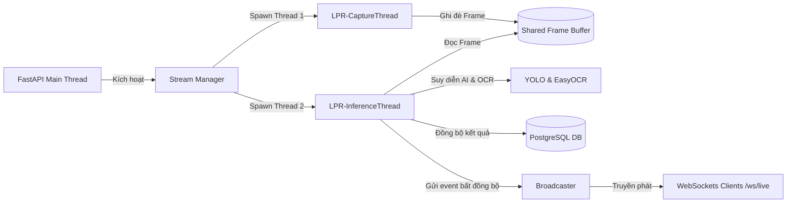

# Báo Cáo Kỹ Thuật: Nhánh Backend
**Dự án:** Nhận diện Biển Số Xe (License Plate Recognition)  
**Tác giả:** Backend Engineering Team  
**Ngày lập:** 24/06/2026  
**Trạng thái:** Bản phác thảo Thiết kế & Hiện trạng Sprint 0  

---

## 📌 Mục lục
1. [Kiến trúc Tổng quan & Lifespan](#1-kiến-trúc-tổng-quan--lifespan)
2. [Chi tiết REST API Endpoints](#2-chi-tiết-rest-api-endpoints)
3. [Xử lý Thời gian thực (Real-time Stream & WebSockets)](#3-xử-lý-thời-gian-thực-real-time-stream--websockets)
4. [Tích hợp Lưu trữ Đối tượng (MinIO Object Storage)](#4-tích-hợp-lưu-trữ-đối-tượng-minio-object-storage)
5. [Cơ chế Quản lý Database Session và Khớp nối Schema](#5-cơ-chế-quản-lý-database-session-và-khớp-nối-schema)
6. [Kế hoạch Sprint & Định hướng Phát triển (Backend Track)](#6-kế-hoạch-sprint--định-hướng-phát-triển-backend-track)
7. [Bản đồ liên kết File & Ký hiệu Code](#7-bản-đồ-liên-kết-file--ký-hiệu-code)

---

## 1. Kiến trúc Tổng quan & Lifespan

Ứng dụng Backend được xây dựng trên nền tảng **FastAPI**, sử dụng mô hình lập trình bất đồng bộ (`async/await`) để tối ưu hóa hiệu năng I/O bound khi giao tiếp với Cơ sở dữ liệu PostgreSQL và Lưu trữ MinIO.

Vòng đời ứng dụng được quản lý tập trung thông qua hàm khởi tạo ngữ cảnh [lifespan](file:///home/leduc1009/BTL_AIT2004-2/apps/api/app/main.py#L21) trong [main.py](file:///home/leduc1009/BTL_AIT2004-2/apps/api/app/main.py):
- **Khi ứng dụng khởi động (Startup):**
  - Cấu hình logger hệ thống.
  - Thực hiện nạp trước (eager-load) các mô hình ML (YOLO và EasyOCR) vào bộ nhớ RAM/VRAM thông qua hàm `preload_ml_components` từ [factories.py](file:///home/leduc1009/BTL_AIT2004-2/apps/api/app/services/factories.py) nhằm loại bỏ độ trễ (latency spike) ở khung hình đầu tiên.
  - Đảm bảo thư mục lưu trữ tạm thời (`upload_dir`) tồn tại trên ổ đĩa.
- **Khi ứng dụng dừng (Shutdown):**
  - Tự động dừng tất cả các luồng xử lý video realtime đang chạy nhằm giải phóng thiết bị bắt hình (capture devices).
  - Đóng và giải phóng hồ chứa kết nối Cơ sở dữ liệu (Database Engine Connection Pool) thông qua lệnh `engine.dispose()`.

---

## 2. Chi tiết REST API Endpoints

Mã nguồn định nghĩa tuyến đường (routing) nằm tại tệp [routes.py](file:///home/leduc1009/BTL_AIT2004-2/apps/api/app/api/routes.py).

### 2.1. Quản lý Nhận diện Biển số (Recognition Router)
- **POST `/api/v1/recognition`:** Tải lên video để xử lý.
  - *Giới hạn kích thước:* Hỗ trợ tệp tối đa $250MB$ (`MAX_FILE_SIZE`).
  - *Định dạng được phép:* `video/mp4`, `video/mpeg`, `video/quicktime` (.mov), `video/x-msvideo` (.avi), `video/x-matroska` (.mkv).
  - *Luồng hoạt động:* Lưu tệp tạm -> Đẩy video lên MinIO thông qua Storage Service -> Sao chép một bản sao cục bộ vào thư mục `uploads/` -> Dừng luồng stream cũ (nếu có) và kích hoạt luồng stream phân tích thời gian thực mới dựa trên tệp cục bộ này -> Trả về mã phản hồi `200 OK` kèm `request_id` và trạng thái ban đầu là `PENDING`.
- **GET `/api/v1/recognition/{request_id}`:** Lấy kết quả chi tiết của yêu cầu nhận diện cụ thể, bao gồm ảnh biển số xe đã được giải quyết URL ký trước (presigned URL) từ MinIO.
- **GET `/api/v1/recognition`:** Lấy danh sách lịch sử các yêu cầu nhận diện dưới dạng phân trang (hỗ trợ tham số `page` và `page_size`).
- **DELETE `/api/v1/recognition/{request_id}`:** Xóa bản ghi lịch sử trong Cơ sở dữ liệu đồng thời dọn dẹp tập tin hình ảnh/video tương ứng trong kho lưu trữ đối tượng MinIO.

### 2.2. Điều khiển Luồng Xử lý Realtime (Streams Router)
- **POST `/api/v1/streams/start`:** Khởi chạy một luồng xử lý video realtime từ nguồn cấu hình sẵn (Camera RTSP hoặc tệp video).
- **POST `/api/v1/streams/stop`:** Dừng luồng xử lý realtime đang hoạt động.
- **GET `/api/v1/streams/status`:** Truy vấn trạng thái hoạt động hiện thời của luồng (đang chạy, đã dừng, hoặc gặp lỗi).

---

## 3. Xử lý Thời gian thực (Real-time Stream & WebSockets)

Xử lý luồng video realtime là sự kết hợp giữa kiến trúc Đa luồng (Multi-threading) để tính toán ML nặng và Lập trình bất đồng bộ (Asynchronous) để truyền phát dữ liệu mạng.

### 3.1. Thiết kế Đa luồng trong StreamManager
Lớp [StreamManager](file:///home/leduc1009/BTL_AIT2004-2/apps/api/app/realtime/manager.py#L11) quản lý hai luồng chạy nền (Background Daemon Threads):
1. **LPR-CaptureThread ([capture_thread_fn](file:///home/leduc1009/BTL_AIT2004-2/apps/api/app/realtime/capture.py)):** Thực hiện đọc tuần tự các khung hình từ camera RTSP hoặc tệp video bằng OpenCV `cv2.VideoCapture` và ghi đè vào bộ đệm khung hình chung [shared_state](file:///home/leduc1009/BTL_AIT2004-2/apps/api/app/realtime/state.py).
2. **LPR-InferenceThread ([inference_loop_fn](file:///home/leduc1009/BTL_AIT2004-2/apps/api/app/realtime/inference.py#L113)):** Lấy khung hình mới nhất từ bộ đệm chung, thay đổi kích thước về độ phân giải chuẩn $1280x720$ để tiết kiệm năng lực CPU, chạy mô hình phát hiện biển số, theo vết, nhận diện OCR và gửi kết quả.

Cơ chế đồng bộ hóa luồng sử dụng biến khóa `threading.Lock` trong Manager và biến cờ hiệu `threading.Event` trong trạng thái dùng chung để kiểm soát việc dừng/chạy luồng an toàn, tránh tranh chấp tài nguyên (race condition).

### 3.2. Cầu nối Đồng bộ sang Bất đồng bộ (Sync-to-Async Bridging)
Vì các luồng chạy nền tính toán học máy là các tiến trình đồng bộ (Blocking Sync) nhằm tận dụng tối đa CPU, nhưng các cổng phát WebSocket và Database của FastAPI lại là bất đồng bộ (Async). Backend giải quyết bằng hàm helper [run_async](file:///home/leduc1009/BTL_AIT2004-2/apps/api/app/realtime/inference.py#L24):
- Truyền tham số `loop` (Vòng lặp sự kiện Asyncio đang chạy của luồng chính FastAPI) vào luồng phụ.
- Khi cần phát tin nhắn WebSocket hoặc ghi nhận dữ liệu vào DB, luồng phụ gọi hàm `asyncio.run_coroutine_threadsafe(coro, loop)` để lập lịch thực thi tác vụ bất đồng bộ một cách an toàn trên luồng chính.

### 3.3. WebSocket Endpoint `/ws/live` & Broadcaster
- Cổng kết nối WebSocket nhận thông tin thời gian thực định nghĩa tại [routes.py](file:///home/leduc1009/BTL_AIT2004-2/apps/api/app/api/routes.py#L240).
- Lớp [Broadcaster](file:///home/leduc1009/BTL_AIT2004-2/apps/api/app/realtime/broadcaster.py#L6) quản lý tập hợp kết nối hoạt động (`active_connections`). Khi phát tin nhắn (`broadcast`), nó duyệt bản sao danh sách kết nối để tránh lỗi đột biến dữ liệu trong khi phát và tự động loại bỏ các kết nối đã đứt (broken connections).
- **Các sự kiện thời gian thực (Events Payload):**
  - `frame.processed`: Phát sau mỗi khoảng thời gian định kỳ (giới hạn tối đa 10 FPS để tránh nghẽn băng thông), chứa ảnh JPG đã nén ở chất lượng 80% mã hóa Base64 và danh sách các đối tượng kèm tọa độ hộp bao dạng phần trăm.
  - `plate.confirmed`: Phát ngay lập tức khi một biển số xe đạt ngưỡng đồng thuận (Temporal Consensus), chứa biển số xe hoàn chỉnh và ảnh chụp để hiển thị trên bảng kết quả.
  - `plate.rejected`: Phát khi đối tượng đi ra khỏi vùng quét hoặc đạt số lần OCR tối đa mà không thống nhất được biển số.
  - `stream.stopped`: Báo hiệu luồng video đã kết thúc hoặc gặp lỗi.

---

## 4. Tích hợp Lưu trữ Đối tượng (MinIO Object Storage)

Mã nguồn tích hợp lưu trữ tại [storage.py](file:///home/leduc1009/BTL_AIT2004-2/apps/api/app/services/storage.py). Lớp trừu tượng [StorageService](file:///home/leduc1009/BTL_AIT2004-2/apps/api/app/services/storage.py#L12) định nghĩa giao diện chung cho hai lớp triển khai:

1. **LocalStorage:** Lưu trữ trực tiếp lên hệ thống tệp tin cục bộ của máy chủ (trong thư mục `uploads/`).
2. **MinioStorage:** Lưu trữ đối tượng lên dịch vụ tương thích AWS S3 (MinIO).

### Cơ chế Tối ưu hóa & Bảo mật của MinioStorage:
- **Tác vụ Không chặn (Non-blocking Tasks):** Bản thân thư viện MinIO SDK cho Python chạy đồng bộ. Để tránh khóa đứng vòng lặp sự kiện chính của FastAPI khi ghi/đọc file lớn, các hàm async như `save`, `save_path`, `get_url` được bọc qua trình thực thi đa luồng `loop.run_in_executor(None, sync_func, ...)`.
- **URL Ký Trước (Presigned GET URL):** Hình ảnh biển số lưu trữ trong MinIO được bảo mật. Khi truy vấn thông tin, hệ thống tạo URL ký trước có thời hạn hiệu lực tối đa 7 ngày thông qua phương thức `client.presigned_get_object`.
- **Tự động Ánh xạ Địa chỉ (URL Path Rewriting):** Trên môi trường Docker, API giao tiếp nội bộ với MinIO qua mạng Docker (`http://minio:9000`). Tuy nhiên, URL ký trước trả về cho trình duyệt bên ngoài phải chuyển đổi thành tên miền công khai (`http://localhost:9000`). Logic xử lý này được triển khai trong phương thức [MinioStorage.get_url_sync](file:///home/leduc1009/BTL_AIT2004-2/apps/api/app/services/storage.py#L101).

---

## 5. Cơ chế Quản lý Database Session và Khớp nối Schema

Hệ thống sử dụng thư viện **SQLAlchemy 2.0** phiên bản bất đồng bộ (`ext.asyncio`).

### 5.1. Hồ chứa Kết nối (Connection Pooling)
Bộ động cơ cơ sở dữ liệu `create_async_engine` được cấu hình tối ưu hóa trong [database.py](file:///home/leduc1009/BTL_AIT2004-2/apps/api/app/shared/database.py#L12):
- `pool_size=5`: Duy trì sẵn 5 kết nối cố định đến Postgres.
- `max_overflow=10`: Cho phép mở rộng thêm tối đa 10 kết nối phụ khi tải cao đột biến.
- `pool_pre_ping=True`: Kiểm tra tính toàn vẹn của kết nối trước khi giao cho truy vấn mới để tránh lỗi mất kết nối vật lý (stale connections).
- `pool_recycle=3600`: Tự động tái tạo kết nối sau 1 giờ.

### 5.2. Quản lý Phiên Giao dịch (Session Lifecycle)
Hàm phụ thuộc [get_db](file:///home/leduc1009/BTL_AIT2004-2/apps/api/app/shared/database.py#L32) sử dụng cơ chế Generator bất đồng bộ (`async def` kết hợp `yield`):
- Tự động mở một Session mới cho mỗi yêu cầu HTTP được gửi đến.
- Thực hiện `session.commit()` tự động nếu toàn bộ tiến trình xử lý API diễn ra thành công.
- Tự động bắt lỗi ngoại lệ để chạy `session.rollback()` nhằm khôi phục lại trạng thái dữ liệu an toàn nếu có lỗi xảy ra, sau đó đóng Session.

---

## 6. Kế hoạch Sprint & Định hướng Phát triển (Backend Track)

Tiến trình Agile của nhánh Backend trải qua 7 Sprint (12 tuần):

- **Sprint 0 (FastAPI Scaffold - Hiện tại):** Khởi tạo khung dự án FastAPI, cài đặt CORS, cấu hình file `alembic.ini`, triển khai endpoint kiểm tra trạng thái `/health`.
- **Sprint 1 (CRUD API):** Xây dựng các API cơ bản để quản lý yêu cầu nhận diện biển số xe (tạo mới, lấy danh sách phân trang, xóa).
- **Sprint 2 (WebSocket & Real-time):** Triển khai endpoint truyền phát dữ liệu thời gian thực `/ws/live`, tích hợp trình phát Broadcaster và thiết kế lớp quản lý luồng StreamManager.
- **Sprint 3 (Storage Integration):** Hoàn thiện dịch vụ lưu trữ kép (MinIO & Local Storage), cấu hình cơ chế tạo link truy cập ảnh ký trước bảo mật. Tích hợp Alembic DB migrations.
- **Sprint 4 (ML Runtime Integration):** Tích hợp sâu thư viện ONNX Runtime vào luồng xử lý và điều khiển luồng, khớp nối luồng suy diễn từ nhánh AI.
- **Sprint 5 (API Hardening):** Tối ưu hóa hiệu năng truy vấn database, cấu hình cơ chế kiểm thử tự động, viết mã kiểm thử tích hợp (Integration Tests) đạt độ bao phủ (Coverage) $\ge 70\%$.
- **Sprint 6 (E2E Integration & Handoff):** Hỗ trợ kiểm thử đầu cuối (E2E) với Frontend, viết tài liệu hướng dẫn vận hành, hoàn tất tiêu chuẩn bàn giao v1.0.

---

## 7. Bản đồ liên kết File & Ký hiệu Code

Dưới đây là các lớp và tệp tin quan trọng nhất thuộc nhánh Backend:

* **Tệp khởi chạy chính:** [main.py](file:///home/leduc1009/BTL_AIT2004-2/apps/api/app/main.py) -> Quản lý lifespan ứng dụng.
* **Các tuyến dẫn HTTP API:** [routes.py](file:///home/leduc1009/BTL_AIT2004-2/apps/api/app/api/routes.py).
* **Quản lý đa luồng stream:** [manager.py](file:///home/leduc1009/BTL_AIT2004-2/apps/api/app/realtime/manager.py) -> Lớp [StreamManager](file:///home/leduc1009/BTL_AIT2004-2/apps/api/app/realtime/manager.py#L11).
* **Vòng lặp suy diễn thời gian thực:** [inference.py](file:///home/leduc1009/BTL_AIT2004-2/apps/api/app/realtime/inference.py) -> Hàm điều khiển [inference_loop_fn](file:///home/leduc1009/BTL_AIT2004-2/apps/api/app/realtime/inference.py#L113).
* **Quản lý kết nối WebSocket:** [broadcaster.py](file:///home/leduc1009/BTL_AIT2004-2/apps/api/app/realtime/broadcaster.py) -> Lớp [Broadcaster](file:///home/leduc1009/BTL_AIT2004-2/apps/api/app/realtime/broadcaster.py#L6).
* **Dịch vụ lưu trữ tệp tin:** [storage.py](file:///home/leduc1009/BTL_AIT2004-2/apps/api/app/services/storage.py) -> Lớp trừu tượng [StorageService](file:///home/leduc1009/BTL_AIT2004-2/apps/api/app/services/storage.py#L12).
* **Cơ chế nạp phiên cơ sở dữ liệu:** [database.py](file:///home/leduc1009/BTL_AIT2004-2/apps/api/app/shared/database.py) -> Bộ quản lý kết nối và hàm [get_db](file:///home/leduc1009/BTL_AIT2004-2/apps/api/app/shared/database.py#L32).
